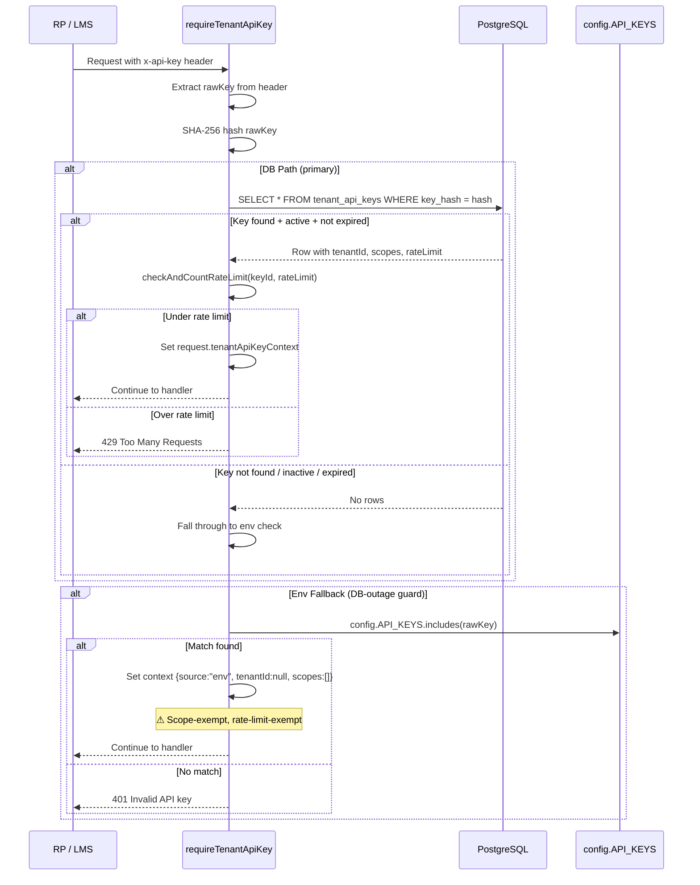
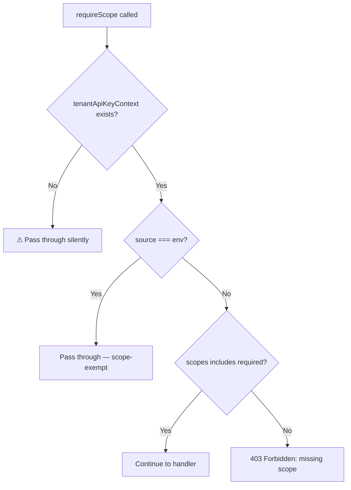
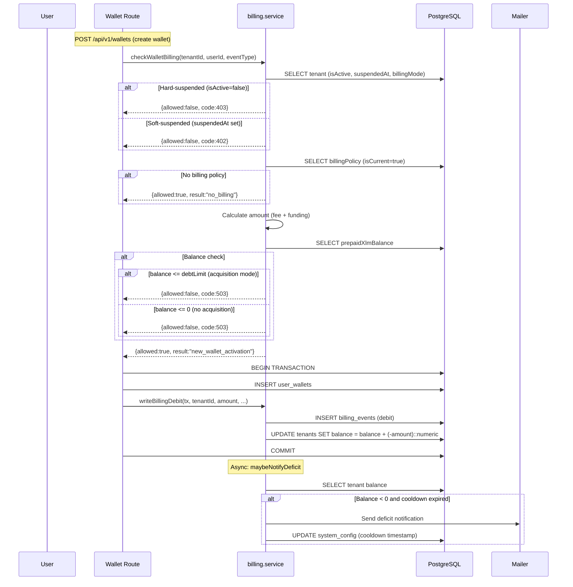
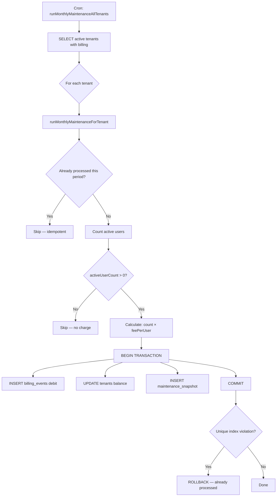
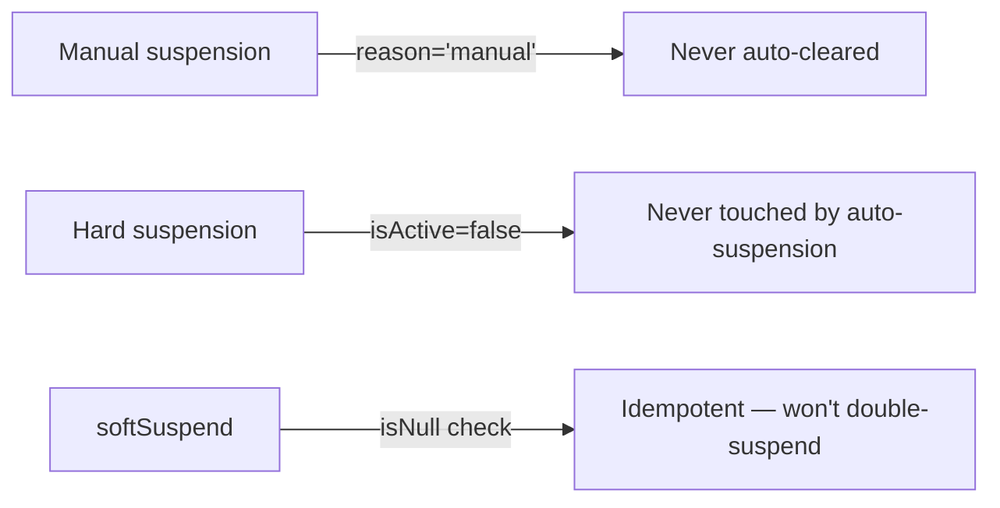
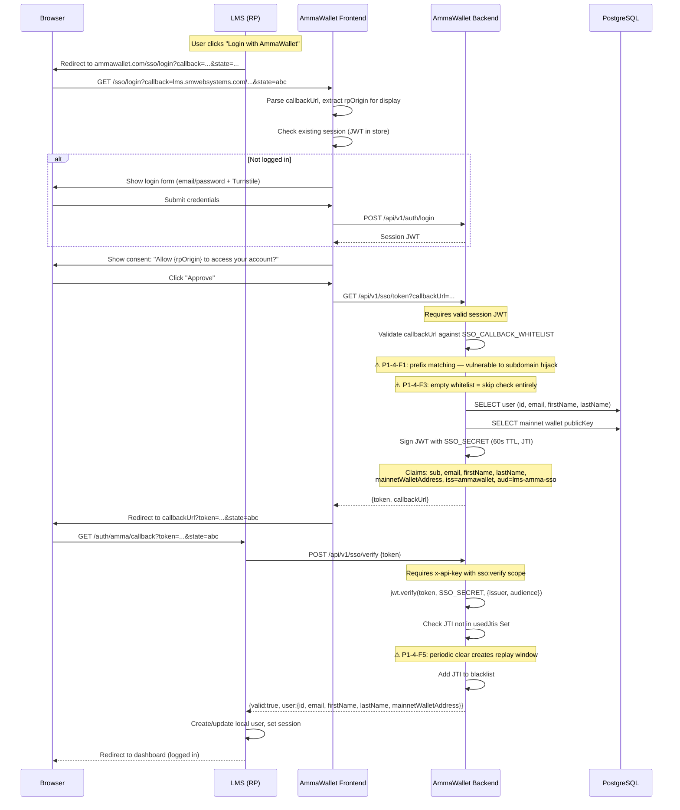

# AmmaWallet Architecture — P1 Module Diagrams

> Generated during full-codebase audit (2026-07-27)
> Branch: `audit/full-codebase-2026-07-26`

---

## 1. Tenant API Key Validation Flow

### Scope Enforcement

---

## 2. Billing Cycle / Invoice Flow

### Monthly Maintenance

---

## 3. Auto-Suspension Trigger Logic

```mermaid
flowchart TD
    subgraph "checkAndRunAutoSuspension (hourly + startup)"
        A[Pass 1: enforceDebtLimit] --> B[Pass 2: enforceMaintGrace]
        B --> C[Pass 3: recoverMaintGrace]
        C --> D[Pass 4: recoverDebtLimit]
    end

    subgraph "Pass 1: enforceDebtLimit"
        E[SELECT unsuspended + isActive + acquisition enabled] --> F{balance ≤ debtLimit?}
        F -- Yes --> G[softSuspend reason=debt_limit]
        G --> H[Notify: tenant contact + admins]
        F -- No --> I[Skip]
    end

    subgraph "Pass 2: enforceMaintGrace"
        J[SELECT unsuspended + isActive + balance < 0] --> K{Grace key exists?}
        K -- No --> L[Write grace_started_at = now]
        K -- Yes --> M{Elapsed > gracePeriodDays?}
        M -- Yes --> N[softSuspend reason=maintenance_grace_expired]
        M -- No --> O[Skip — still in grace]
    end

    subgraph "Pass 3: recoverMaintGrace"
        P[SELECT suspended reason=maint_grace + isActive] --> Q{balance > 0?}
        Q -- Yes --> R[unsuspend + clear grace key]
        R --> S[Notify: recovery email]
        Q -- No --> T[Skip]
    end

    subgraph "Pass 4: recoverDebtLimit"
        U[SELECT suspended reason=debt_limit + isActive] --> V{balance > debtLimit/2?}
        V -- Yes --> W[unsuspend]
        W --> X[Notify: recovery email]
        V -- No --> Y[Skip]
    end

    style G fill:#f66
    style N fill:#f66
    style R fill:#6f6
    style W fill:#6f6
```

### Guards

---

## 4. SSO Token Exchange Flow (LMS → AmmaWallet)

### Key Security Properties

| Property | Status | Notes |
|----------|--------|-------|
| Separate signing secret | PASS | `SSO_SECRET` ≠ `JWT_SECRET` (but not enforced at startup) |
| Short TTL | PASS | 60 seconds |
| One-time use (JTI) | PASS* | In-memory, periodic clear creates ~59s replay window |
| Server-to-server verify | PASS | Requires `x-api-key` with `sso:verify` scope |
| Callback whitelist | FAIL | Prefix matching vulnerable to domain confusion |
| Fail-closed on misconfig | FAIL | Empty whitelist = allow all |
