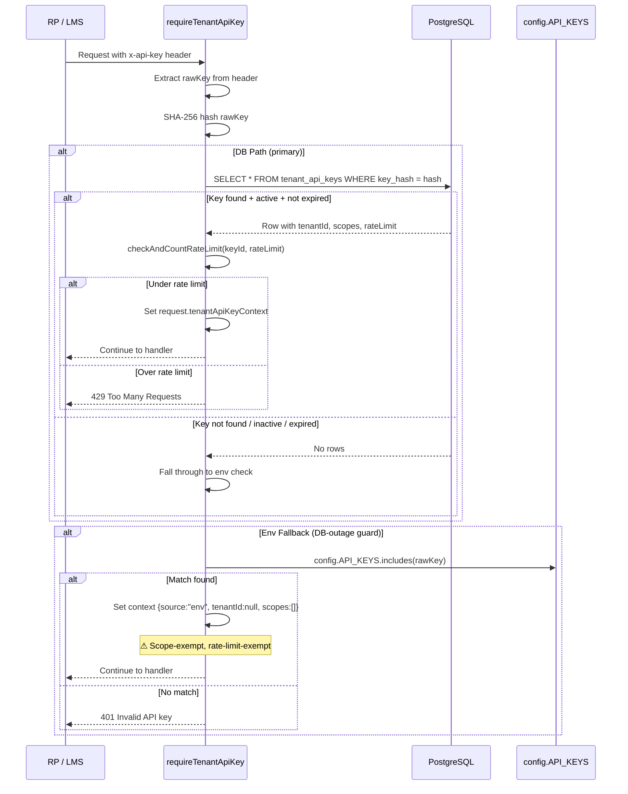
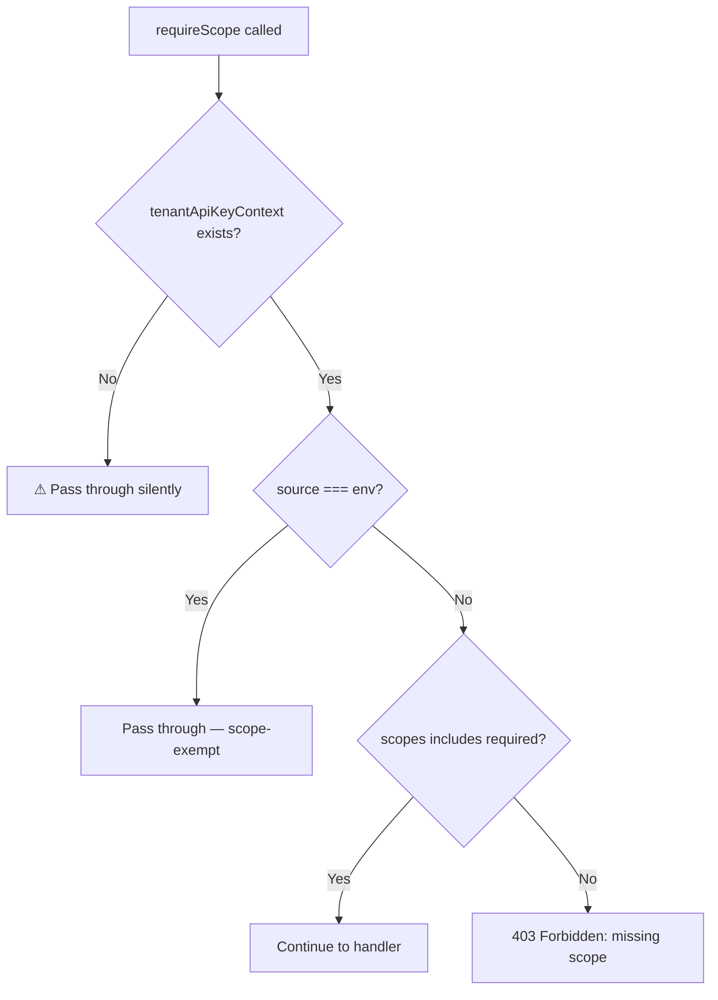
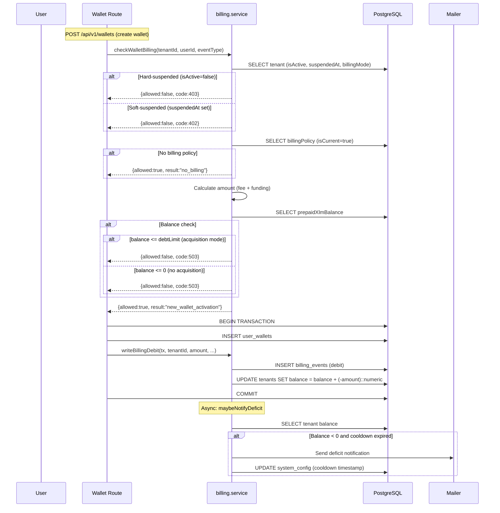
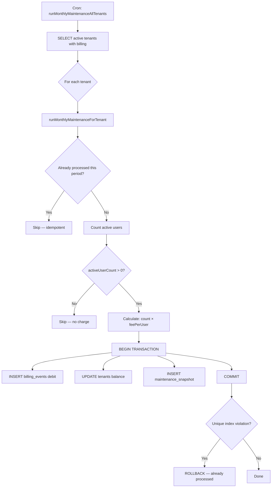
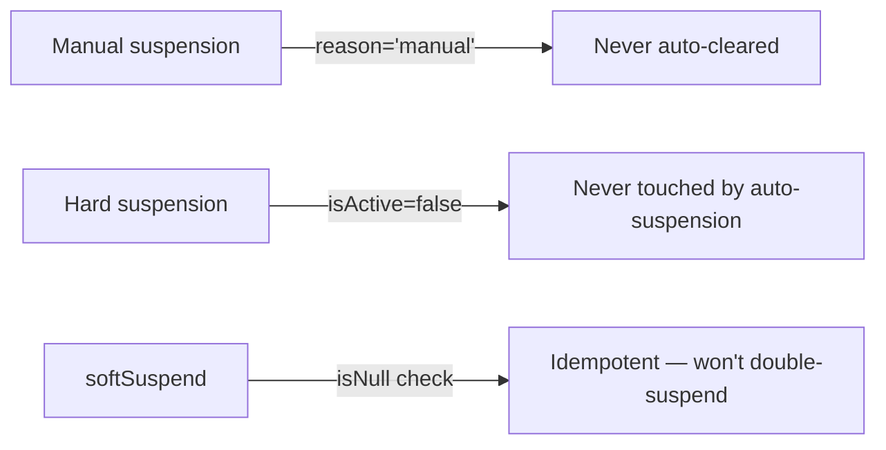
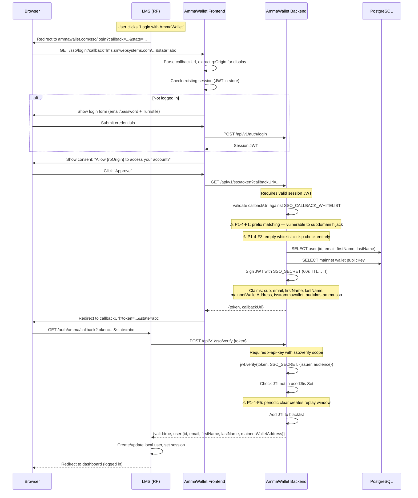
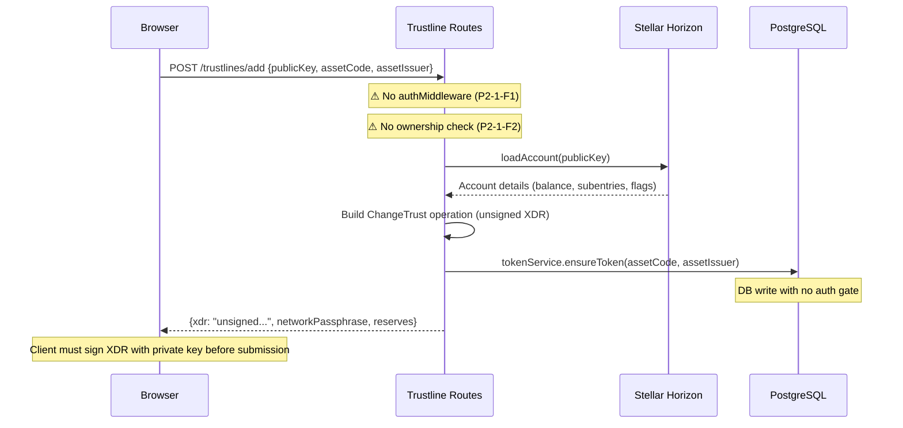
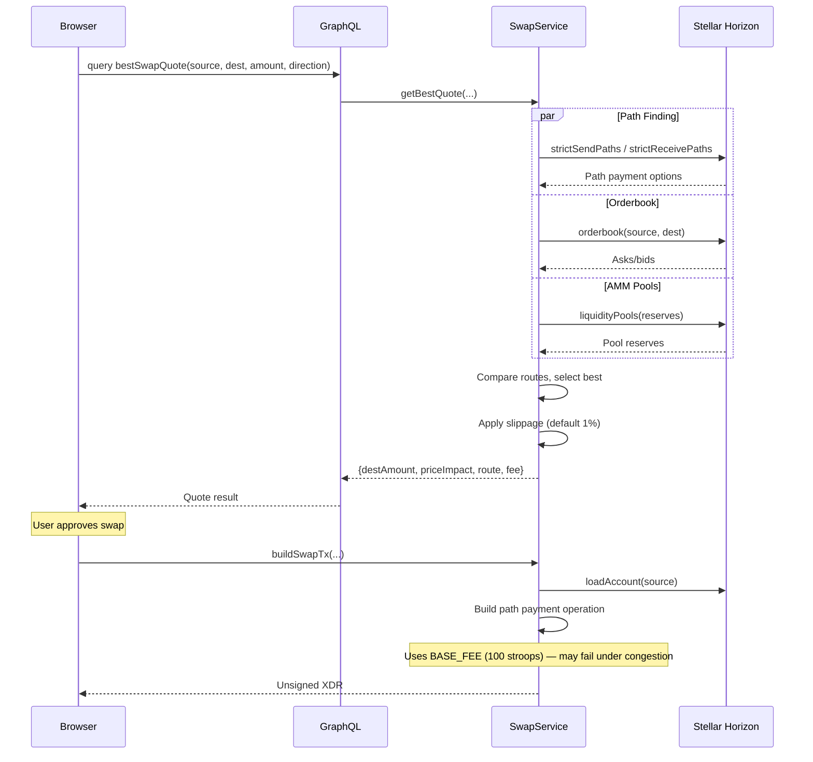

# AmmaWallet Architecture — Audit Diagrams (P1 + P2)

> Generated during full-codebase audit (2026-07-27)
> Branch: `audit/full-codebase-2026-07-26`

---

## 1. Tenant API Key Validation Flow



### Scope Enforcement



---

## 2. Billing Cycle / Invoice Flow



### Monthly Maintenance



---

## 3. Auto-Suspension Trigger Logic

```mermaid
flowchart TD
    subgraph "checkAndRunAutoSuspension (hourly + startup)"
        A[Pass 1: enforceDebtLimit] --> B[Pass 2: enforceMaintGrace]
        B --> C[Pass 3: recoverMaintGrace]
        C --> D[Pass 4: recoverDebtLimit]
    end

    subgraph "Pass 1: enforceDebtLimit"
        E[SELECT unsuspended + isActive + acquisition enabled] --> F{balance ≤ debtLimit?}
        F -- Yes --> G[softSuspend reason=debt_limit]
        G --> H[Notify: tenant contact + admins]
        F -- No --> I[Skip]
    end

    subgraph "Pass 2: enforceMaintGrace"
        J[SELECT unsuspended + isActive + balance < 0] --> K{Grace key exists?}
        K -- No --> L[Write grace_started_at = now]
        K -- Yes --> M{Elapsed > gracePeriodDays?}
        M -- Yes --> N[softSuspend reason=maintenance_grace_expired]
        M -- No --> O[Skip — still in grace]
    end

    subgraph "Pass 3: recoverMaintGrace"
        P[SELECT suspended reason=maint_grace + isActive] --> Q{balance > 0?}
        Q -- Yes --> R[unsuspend + clear grace key]
        R --> S[Notify: recovery email]
        Q -- No --> T[Skip]
    end

    subgraph "Pass 4: recoverDebtLimit"
        U[SELECT suspended reason=debt_limit + isActive] --> V{balance > debtLimit/2?}
        V -- Yes --> W[unsuspend]
        W --> X[Notify: recovery email]
        V -- No --> Y[Skip]
    end

    style G fill:#f66
    style N fill:#f66
    style R fill:#6f6
    style W fill:#6f6
```



### Guards



---

## 4. SSO Token Exchange Flow (LMS → AmmaWallet)



### Key Security Properties

| Property | Status | Notes |
|----------|--------|-------|
| Separate signing secret | PASS | `SSO_SECRET` ≠ `JWT_SECRET` (but not enforced at startup) |
| Short TTL | PASS | 60 seconds |
| One-time use (JTI) | PASS* | In-memory, periodic clear creates ~59s replay window |
| Server-to-server verify | PASS | Requires `x-api-key` with `sso:verify` scope |
| Callback whitelist | FAIL | Prefix matching vulnerable to domain confusion |
| Fail-closed on misconfig | FAIL | Empty whitelist = allow all |

---

## P2 Module Diagrams

### 5. Trustline Management Flow



### 6. Token Indexer Pipeline

```mermaid
flowchart TD
    A[Cron: token-indexer.ts] --> B[discoverFromHorizon]
    B --> C[Fetch 200 assets from Horizon]
    C --> D{For each asset with num_accounts >= 3}
    D --> E[INSERT token if not exists]
    E --> F[enrichFromStellarExpert]
    F --> G[Fetch rating, volume, rank data]
    G --> H[UPDATE tokens with enrichment data]
    H --> I[syncTomlMetadata]
    I --> J{For each token with homeDomain}
    J --> K["fetch https://{homeDomain}/.well-known/stellar.toml"]
    Note over K: ⚠ SSRF risk — no domain validation (P2-2-F1)
    K --> L[Extract currency image URL]
    L --> M[UPDATE tokens SET tomlImage]
    M --> N[resolveIcons]
    N --> O[Download icon files to /data/icons/]
    Note over O: ⚠ No max file size (P2-2-F3)

    style K fill:#ff9
    style O fill:#ff9
```

### 7. Swap Quote + Execution Flow



### 8. Audit Logging Coverage Map

```mermaid
flowchart LR
    subgraph "Defined AuditAction Types (17)"
        A1[login] --- S1[❌ NEVER EMITTED]
        A2[login_failed] --- S2[✅ auth.ts:313]
        A3[login_locked] --- S3[✅ auth.ts:333]
        A4[register] --- S4[✅ auth.ts:163]
        A5[logout] --- S5[✅ auth.ts:602]
        A6[password_change] --- S6[❌ NEVER EMITTED]
        A7[password_reset] --- S7[✅ auth.ts:1019,1422]
        A8[password_reset_request] --- S8[✅ auth.ts:908]
        A9[profile_update] --- S9[❌ NEVER EMITTED]
        A10[2fa_enable] --- S10[❌ NEVER EMITTED]
        A11[2fa_disable] --- S11[❌ NEVER EMITTED]
        A12[signing_mode_change] --- S12[❌ NEVER EMITTED]
        A13[transaction_sign] --- S13[✅ server.ts:1635]
        A14[transaction_submit] --- S14[✅ server.ts:1174]
        A15[wallet_add] --- S15[❌ NEVER EMITTED]
        A16[wallet_remove] --- S16[❌ NEVER EMITTED]
        A17[api_key_create] --- S17[❌ NEVER EMITTED]
    end

    subgraph "Undeclared Actions (wrong signature)"
        B1[nft_collection_registered] --- T1["⚠ nft.ts:110 — WRONG ARGS"]
        B2[nft_transfer] --- T2["⚠ nft.ts:321 — WRONG ARGS"]
        B3[nft_mint_indexed] --- T3["⚠ nft.ts:393 — WRONG ARGS"]
        B4[fiat_stripe_session] --- T4["⚠ fiat.ts:281 — WRONG ARGS"]
    end

    style S1 fill:#f66
    style S6 fill:#f66
    style S9 fill:#f66
    style S10 fill:#f66
    style S11 fill:#f66
    style S12 fill:#f66
    style S15 fill:#f66
    style S16 fill:#f66
    style S17 fill:#f66
    style T1 fill:#ff9
    style T2 fill:#ff9
    style T3 fill:#ff9
    style T4 fill:#ff9
```


