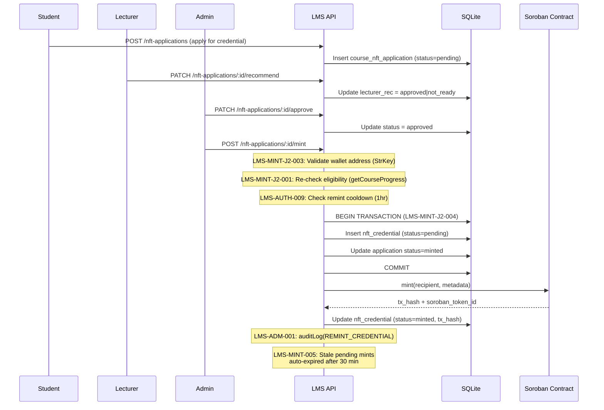
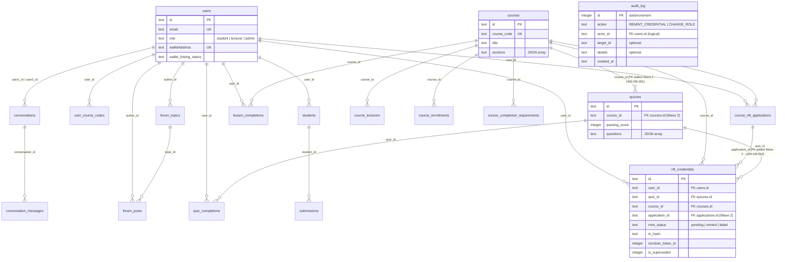

# LMS-AmmaWallet — Architecture Reference

**Date:** 2026-07-30
**Updated for:** Wave 2 Security Remediation

---

## 1. System Overview

**LMS-AmmaWallet** is a learner management system with blockchain credential minting:

- **Frontend:** React/Vite/TypeScript SPA
- **Backend:** Node.js/Express/TypeScript REST API
- **Database:** SQLite (better-sqlite3, synchronous)
- **Blockchain:** Stellar/Soroban for NFT credential minting
- **Auth:** JWT (local) + AmmaWallet SSO (external IdP)
- **Deploy:** Docker Compose (lms-api + lms-web containers)

---

## 2. Mint / Blockchain Flow

---

## 3. DB Schema Relationships

---

## 4. Security Layers

| Layer | Mechanism | Wave 2 Finding |
|-------|-----------|----------------|
| Authentication | JWT with mandatory secret (no fallback) | LMS-AUTH-001 |
| SSO | AmmaWallet IdP, separate state secret | LMS-SSO-002 |
| RBAC | Role-based middleware (admin/lecturer/student) | LMS-USER-001, LMS-J1-001 |
| Rate limiting | Global (60/min), read (120/min), auth (per-endpoint) | LMS-RATE-002/003 |
| Input validation | Email RFC 5322, name/body length limits, JSON 1MB | LMS-INPUT-* |
| Output encoding | HTML-escape in announcements and emails | LMS-XSS-003, LMS-EMAIL-001 |
| SQL safety | Parameterized queries, column allowlist | LMS-SQLI-002 |
| Error handling | Sanitized responses (no SQLite internals), sanitized logs | LMS-ERR-* |
| FK constraints | quizzes→courses, credentials→applications | LMS-DB-001/002 |
| Mint safety | Eligibility re-check, wallet validation, TOCTOU guard, cooldown | LMS-MINT-* |
| Audit trail | audit_log table for admin mutations | LMS-ADM-001/006 |
| File safety | Content-Disposition sanitization | LMS-INPUT-005 |
