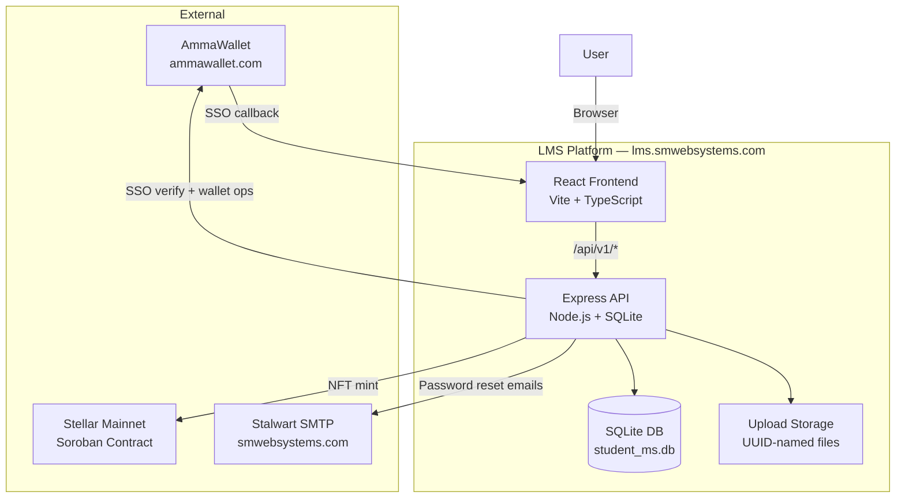
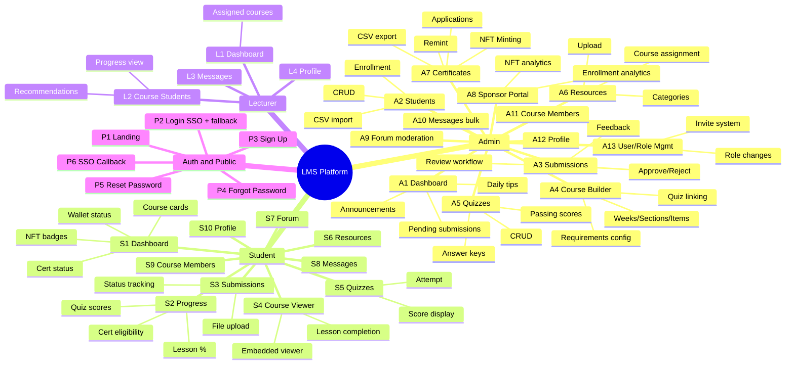
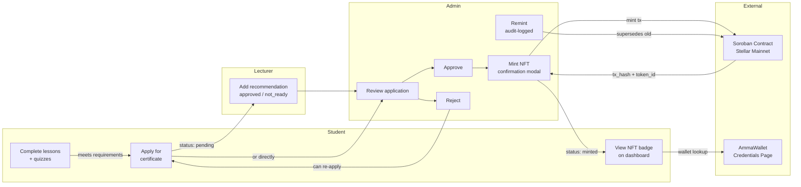
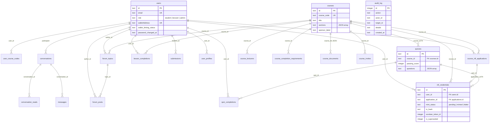
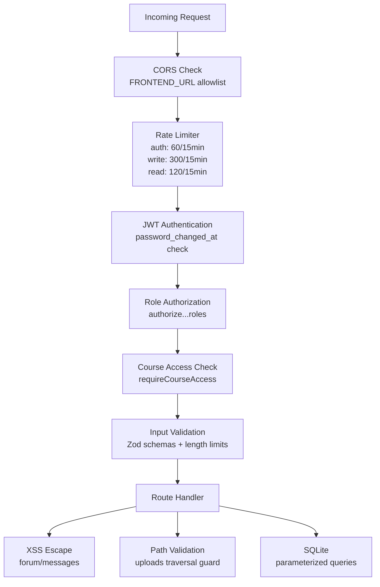

# LMS-Crypto-Production — Architecture Overview

> **Purpose:** Visual overview of the full LMS solution for QA reviewers. Read this before starting any checklist.
> **Date:** 2026-07-31
> **Updated for:** Full-solution manual QA (supersedes Wave 2 architecture doc)

---

## 1. System Context



---

## 2. Role → Module Map



---

## 3. Certificate / NFT Pipeline (Cross-Role Flow)

This is the most complex cross-role flow. It touches Student, Lecturer, and Admin roles plus external AmmaWallet and Stellar integrations.



### Certificate States

| State | Meaning | Who Sets It |
|-------|---------|-------------|
| `not_eligible` | Requirements not met (lessons, quizzes, submissions) | System (auto-calculated) |
| `eligible` | All requirements met, can apply | System (auto-calculated) |
| `pending` | Application submitted, awaiting review | Student applies |
| `approved` | Admin approved, ready to mint | Admin |
| `rejected` | Admin rejected (student can re-apply) | Admin |
| `minted` | NFT minted on Stellar mainnet | Admin (mint action) |

---

## 4. Authentication Flow

```mermaid
flowchart TD
    START[User visits lms.smwebsystems.com] --> LANDING[Landing Page]
    LANDING --> LOGIN[Login Page]

    LOGIN -->|Primary| SSO[Click AmmaWallet SSO]
    LOGIN -->|Fallback| EMAIL[Expand email/password form]

    SSO --> AW_LOGIN[Redirect to ammawallet.com/sso/login]
    AW_LOGIN --> AW_AUTH[User authenticates on AmmaWallet]
    AW_AUTH --> CALLBACK[/sso-callback with JWT hash]
    CALLBACK --> STORE[Store JWT in localStorage]

    EMAIL --> API_LOGIN[POST /api/v1/auth/login]
    API_LOGIN --> STORE

    STORE --> ROLE{Check user.role}
    ROLE -->|student| STUDENT_DASH[/student]
    ROLE -->|lecturer| LECTURER_DASH[/lecturer]
    ROLE -->|admin| ADMIN_DASH[/admin]

    STORE --> HYDRATE[GET /api/v1/auth/me on app boot]
    HYDRATE --> ROLE
```

---

## 5. DB Schema Relationships



---

## 6. Security Layers



| Layer | Mechanism | Related Finding |
|-------|-----------|----------------|
| Authentication | JWT with mandatory secret (no fallback) | LMS-AUTH-001 |
| SSO | AmmaWallet IdP, separate state secret | — |
| RBAC | Role-based middleware (admin/lecturer/student) | LMS-RBAC-006 |
| Rate limiting | Auth (60/15min), write (300/15min), read (120/15min), diag (20/15min) | LMS-RATE-001 |
| Input validation | Email RFC 5322, name/body length limits, JSON 1MB | — |
| Output encoding | HTML-escape in forum/messages | LMS-XSS-001/002 |
| SQL safety | Parameterized queries via better-sqlite3 | — |
| Error handling | Sanitized responses (no SQLite internals in production) | LMS-ERR-001 |
| FK constraints | quizzes→courses, credentials→applications | LMS-DB-001/002 |
| Mint safety | Eligibility re-check, wallet validation, TOCTOU guard, cooldown | LMS-MINT-002 |
| Audit trail | audit_log table for admin mutations | — |
| File safety | MIME whitelist, UUID names, path traversal guard | LMS-UPLOAD-001 |

---

## 7. Legend

- **Solid arrows:** Data/request flow
- **Subgraph borders:** System boundaries
- **🔒 in checklists:** Tied to a fixed security finding (see FEATURE_INVENTORY.md regression table)
- **Recommended QA order:** Admin → Student → Lecturer → Cross-cutting
