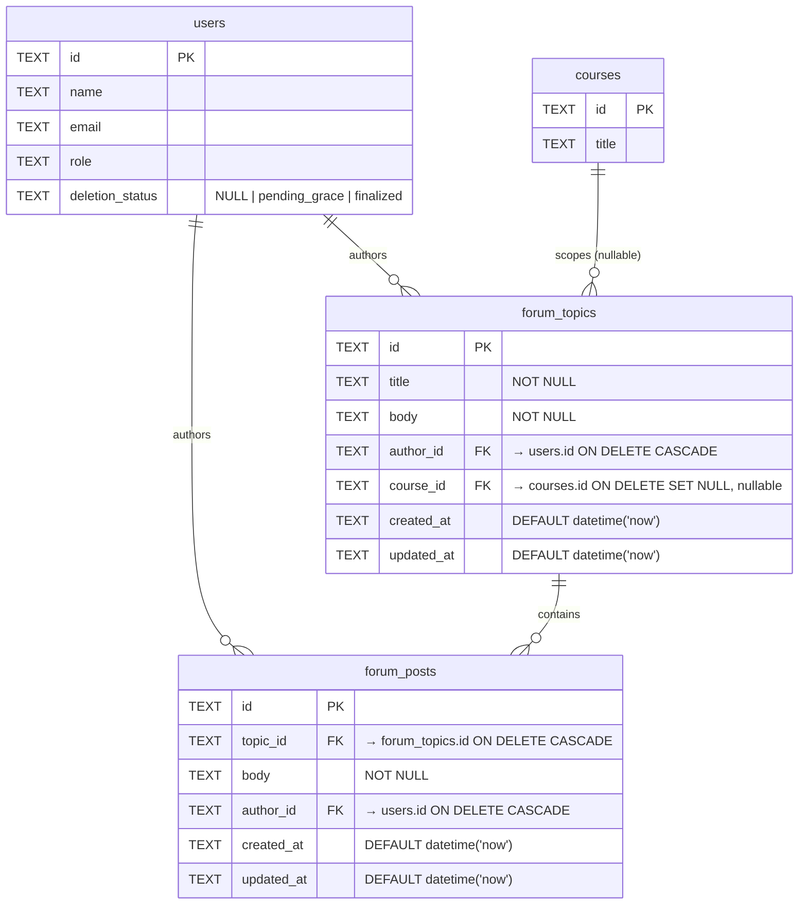

# Forum Data Model — Current State

## Notes

- **No soft-delete columns.** No `is_deleted`, `deleted_at`, `deleted_by`, or `deletion_type` on either table.
- **No delete endpoints.** Only GET (list/detail) and POST (create) exist.
- **Account anonymization** is handled via LEFT JOIN to `users` — when `deletion_status = 'finalized'`, the controller returns `name: "Deleted User"` and hides email. The topic/post body is NOT anonymized.
- **CASCADE on user delete:** `ON DELETE CASCADE` means hard-deleting a user would cascade-delete all their topics and posts. In practice, hard deletes don't happen — `anonymizeUser()` is used instead.
- **Course scoping:** `forum_topics.course_id` is nullable — NULL means "General" channel.
- **Existing indexes:** `idx_forum_topics_author`, `idx_forum_topics_course_id`, `idx_forum_posts_topic`, `idx_forum_posts_author`.
- **RBAC:** `forum.view`, `forum.post`, `forum.moderate` permissions exist. `forum.moderate` is assigned to instructor, admin, admin2, super_admin. Not currently wired to any route guard.
