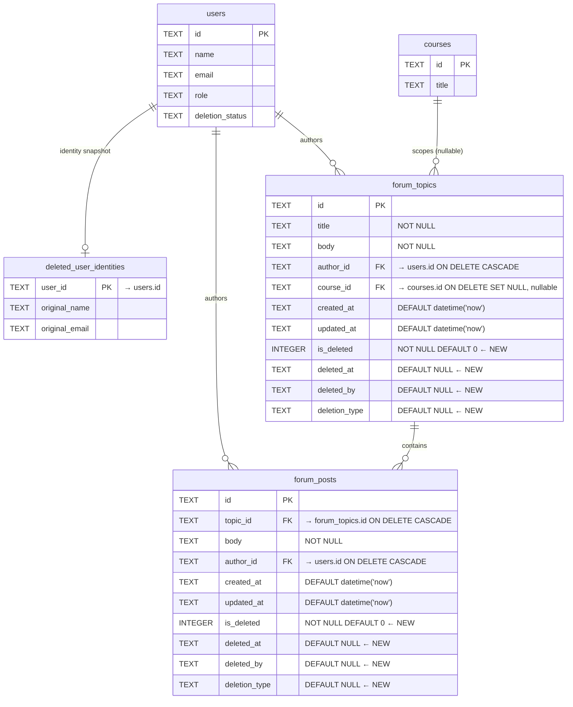

# Forum Data Model — Target State (Phase 2: Forum Soft-Delete)

## New Columns (Both Tables)

| Column | Type | Default | Purpose |
|--------|------|---------|---------|
| `is_deleted` | INTEGER NOT NULL | 0 | Soft-delete flag (0=active, 1=deleted) |
| `deleted_at` | TEXT | NULL | ISO timestamp of deletion |
| `deleted_by` | TEXT | NULL | User ID who performed the deletion |
| `deletion_type` | TEXT | NULL | `self_delete`, `moderator_delete`, `account_deletion` |

## New Indexes

| Index | Table | Column(s) | Purpose |
|-------|-------|-----------|---------|
| `idx_forum_topics_deleted` | `forum_topics` | `is_deleted` | Efficient filtering of active topics |
| `idx_forum_posts_deleted` | `forum_posts` | `is_deleted` | Efficient filtering of active posts |

## New RBAC Permission

| Permission | Category | Description | Assigned To |
|-----------|----------|-------------|-------------|
| `forum.view_deleted` | forum | View deleted forum content (admin audit) | admin, admin2, super_admin |

Existing `forum.moderate` (instructor, admin, admin2, super_admin) is used for moderator delete actions.

## Key Behaviors

1. **User self-delete:** Author can delete own topic or post. Sets `deletion_type = 'self_delete'`.
2. **Moderator delete:** User with `forum.moderate` can delete any topic or post. Sets `deletion_type = 'moderator_delete'`.
3. **Soft-cascade:** Deleting a topic also soft-deletes all its posts (same `deleted_by`, `deletion_type = 'topic_cascade'`).
4. **Tombstone rendering:** Deleted topics show "[This topic was removed]" with title hidden. Deleted posts show "[This reply was removed]" with body hidden.
5. **Admin audit:** Users with `forum.view_deleted` can see original content, deletion metadata, and recovered sender identity (via `deleted_user_identities` JOIN).
