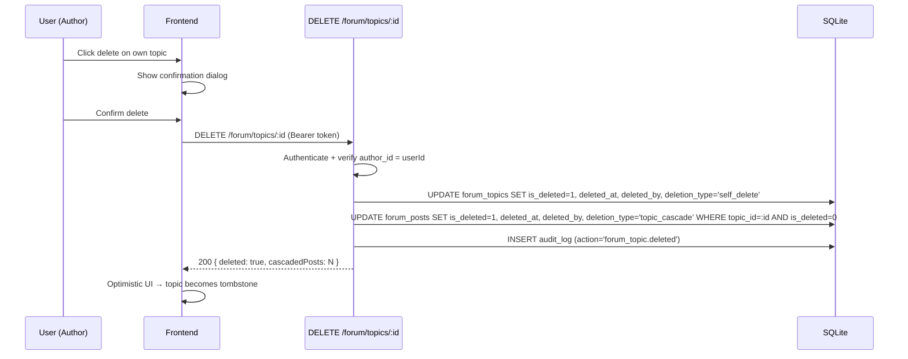
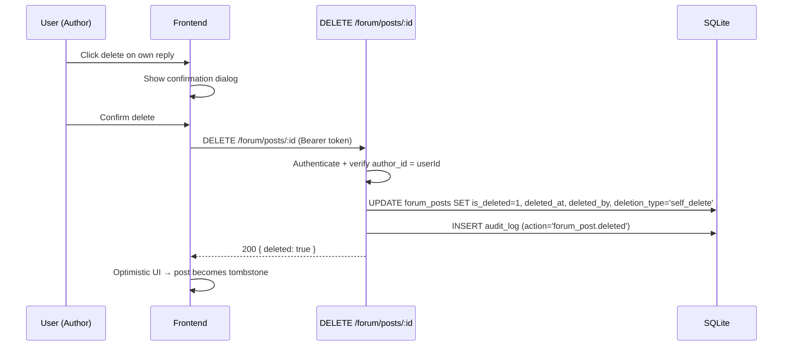
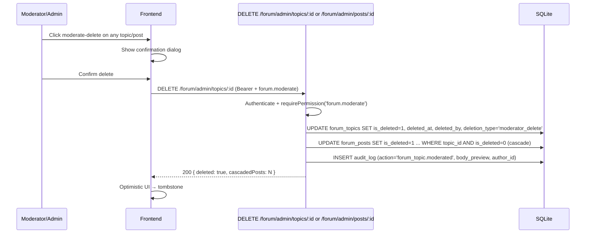
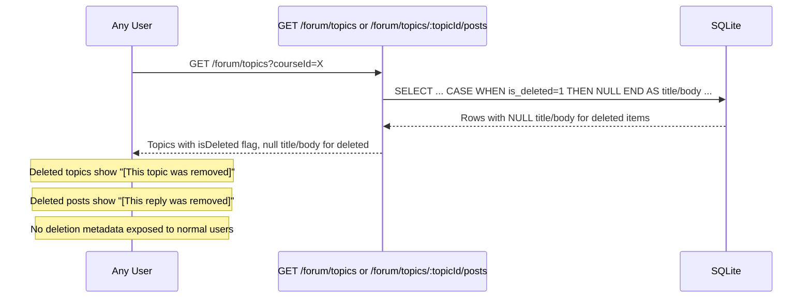
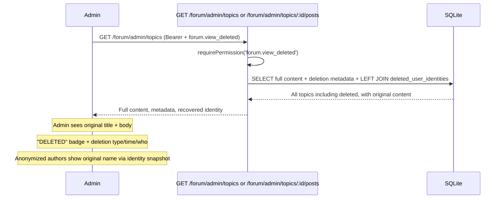

# Forum Deletion Flows

## 1. User Self-Delete (Own Topic)

## 2. User Self-Delete (Own Post)

## 3. Moderator Delete (Any Topic or Post)

## 4. User-Facing Query (Tombstone Rendering)

## 5. Admin Audit View

## Error Cases

| Scenario | HTTP | Code |
|----------|------|------|
| Topic/post not found | 404 | NOT_FOUND |
| Not the author (self-delete) | 403 | FORBIDDEN |
| Already deleted | 409 | CONFLICT |
| No `forum.moderate` (admin endpoint) | 403 | FORBIDDEN |
| Unauthenticated | 401 | UNAUTHORIZED |
| Topic is deleted → cannot post reply | 403 | FORBIDDEN ("Topic has been removed") |
