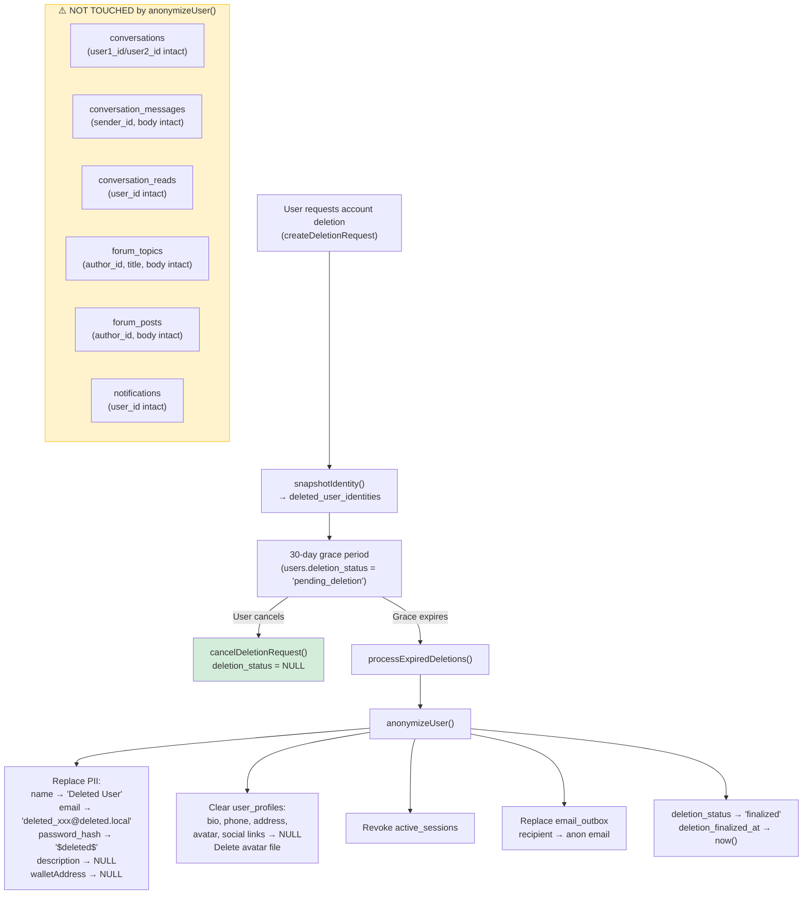
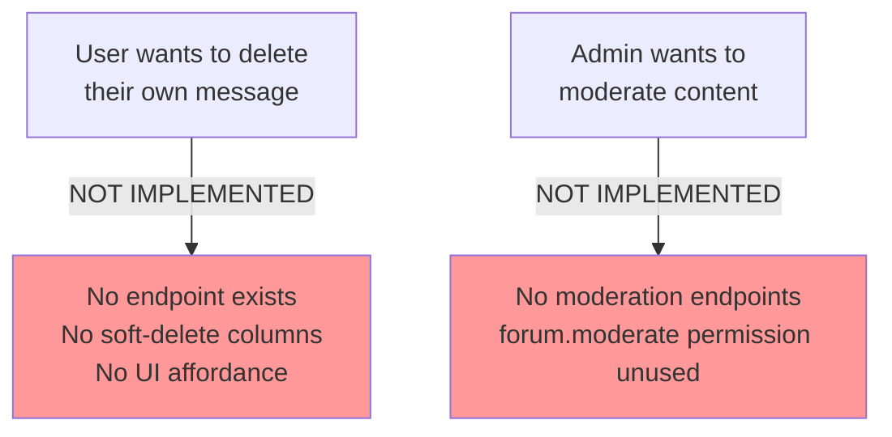

# Deletion & Anonymization Flow — Current State

**Date:** 2026-09-06

---

## Current Account Deletion Flow (Impact on Messages)

## Current User Message Deletion Flow

## Gaps

1. **Messages survive anonymization** — After account deletion, `conversation_messages.body` and `sender_id` remain, but `sender_id` now points to an anonymized user row (`name = 'Deleted User'`). The message content itself is fully preserved and readable by the other participant.
2. **No individual message deletion** — Users cannot delete a single message they sent.
3. **No admin moderation** — Admins cannot hide, remove, or moderate any message or forum content.
4. **Forum content orphaned** — Forum topics/posts by deleted users show "Deleted User" as author but content is fully visible.
5. **Notifications not cleaned** — Notification rows for deleted users persist indefinitely.
