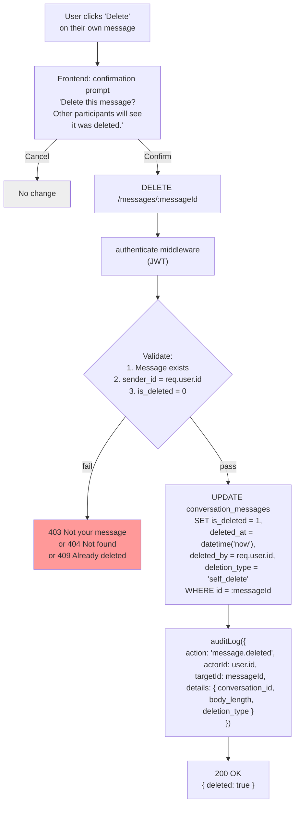
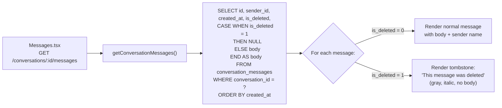
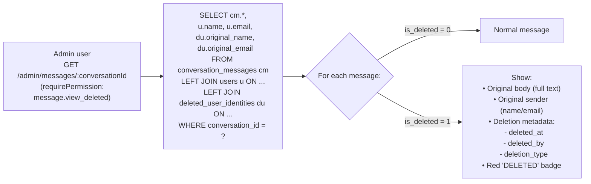
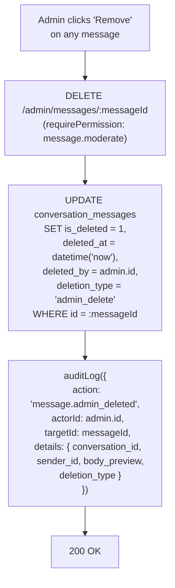
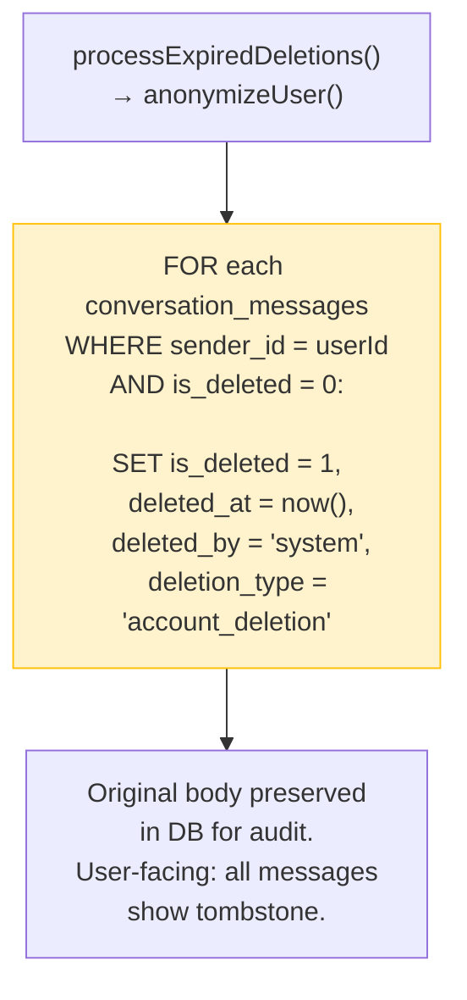

# Deletion Flow — Target State (DM Soft-Delete)

**Date:** 2026-09-06
**Phase:** DM soft-delete with user-facing tombstone + admin audit view

---

## User Deletes Own DM

## User-Facing Conversation View (With Tombstone)

## Admin/Audit View (Full Content)

## Admin Deletes a Message (Moderation)

## Account Deletion Integration (Future Enhancement)

## Data Retention Summary

| Scenario | User-facing view | Admin/audit view | DB row |
|----------|-----------------|------------------|--------|
| Normal message | Body + sender name | Body + sender name | Full row |
| Self-deleted message | Tombstone ("This message was deleted") | Full body + sender + deletion metadata | Full row (is_deleted=1) |
| Admin-deleted message | Tombstone | Full body + sender + deletion metadata + admin who deleted | Full row (is_deleted=1) |
| Account-deleted user's messages | Tombstone + "Deleted User" | Full body + original identity (from deleted_user_identities) | Full row (is_deleted=1, sender→anonymized user) |
