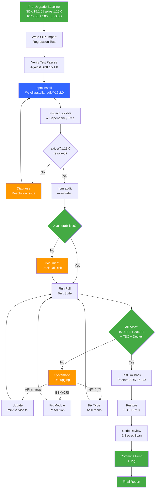

# Stellar SDK v16 Migration Flow

```mermaid
graph TD
    START["Pre-Upgrade Baseline<br/>SDK 15.1.0 | axios 1.15.0<br/>1076 BE + 206 FE PASS"] --> TESTS["Write SDK Import<br/>Regression Test"]
    TESTS --> VERIFY_PRE["Verify Test Passes<br/>Against SDK 15.1.0"]

    VERIFY_PRE --> UPGRADE["npm install<br/>@stellar/stellar-sdk@16.2.0"]
    UPGRADE --> INSPECT["Inspect Lockfile<br/>& Dependency Tree"]

    INSPECT --> CHECK_AXIOS{"axios@1.18.0<br/>resolved?"}
    CHECK_AXIOS -->|No| DIAGNOSE["Diagnose<br/>Resolution Issue"]
    DIAGNOSE --> UPGRADE
    CHECK_AXIOS -->|Yes| AUDIT["npm audit<br/>--omit=dev"]

    AUDIT --> AUDIT_CHECK{"0 vulnerabilities?"}
    AUDIT_CHECK -->|No| DOC_RISK["Document<br/>Residual Risk"]
    AUDIT_CHECK -->|Yes| RUN_TESTS["Run Full<br/>Test Suite"]
    DOC_RISK --> RUN_TESTS

    RUN_TESTS --> TEST_CHECK{"All pass?<br/>1076 BE + 206 FE<br/>+ TSC + Docker"}
    TEST_CHECK -->|No| DEBUG["Systematic<br/>Debugging"]
    DEBUG -->|"API change"| FIX_API["Update<br/>mintService.ts"]
    DEBUG -->|"ESM/CJS"| FIX_ESM["Fix Module<br/>Resolution"]
    DEBUG -->|"Type error"| FIX_TYPE["Fix Type<br/>Assertions"]
    FIX_API --> RUN_TESTS
    FIX_ESM --> RUN_TESTS
    FIX_TYPE --> RUN_TESTS

    TEST_CHECK -->|Yes| ROLLBACK_TEST["Test Rollback<br/>Restore SDK 15.1.0"]
    ROLLBACK_TEST --> RESTORE["Restore<br/>SDK 16.2.0"]
    RESTORE --> REVIEW["Code Review<br/>& Secret Scan"]
    REVIEW --> COMMIT["Commit + Push<br/>+ Tag"]
    COMMIT --> REPORT["Final Report"]

    style START fill:#4a4,color:#fff
    style UPGRADE fill:#36f,color:#fff
    style AUDIT_CHECK fill:#4a4,color:#fff
    style TEST_CHECK fill:#4a4,color:#fff
    style COMMIT fill:#4a4,color:#fff
    style REPORT fill:#4a4,color:#fff
    style DEBUG fill:#f90,color:#fff
    style DIAGNOSE fill:#f90,color:#fff
    style DOC_RISK fill:#f90,color:#fff
```
