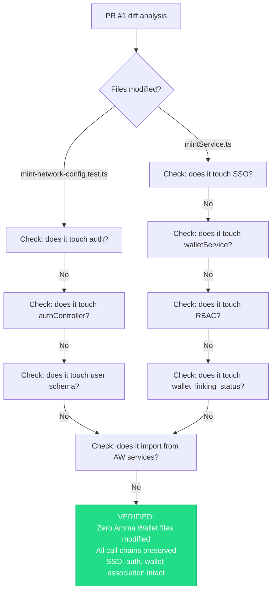

# Amma Wallet Preservation Verification Flow

```mermaid
flowchart TD
    Start["PR #1 diff analysis"] --> FileCheck{"Files modified?"}
    FileCheck -->|"mintService.ts"| AW1["Check: does it touch SSO?"]
    FileCheck -->|"mint-network-config.test.ts"| AW2["Check: does it touch auth?"]

    AW1 -->|No| AW3["Check: does it touch walletService?"]
    AW2 -->|No| AW4["Check: does it touch authController?"]

    AW3 -->|No| AW5["Check: does it touch RBAC?"]
    AW4 -->|No| AW6["Check: does it touch user schema?"]

    AW5 -->|No| AW7["Check: does it touch wallet_linking_status?"]
    AW6 -->|No| AW8["Check: does it import from AW services?"]

    AW7 -->|No| AW8
    AW8 -->|No| Verdict["VERIFIED:<br/>Zero Amma Wallet files modified<br/>All call chains preserved<br/>SSO, auth, wallet association intact"]

    style Verdict fill:#2d8,stroke:#0a6,color:#fff
```
