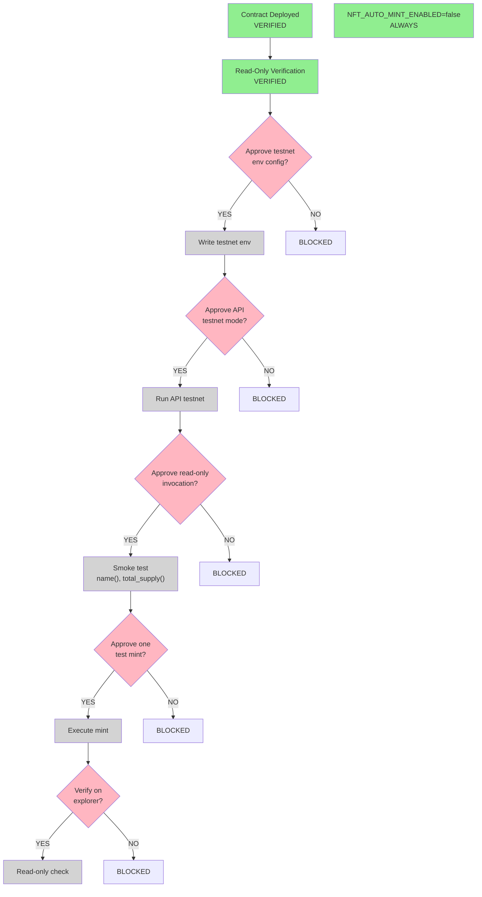

# Approval Gates and Loop

**Date:** 2026-08-19

```mermaid
graph TD
    DEPLOY["Contract Deployed<br/>VERIFIED"] --> VERIFY["Read-Only Verification<br/>VERIFIED"]
    VERIFY --> GATE1{"Approve testnet<br/>env config?"}
    GATE1 -->|"YES"| CONFIG["Write testnet env"]
    GATE1 -->|"NO"| WAIT1["BLOCKED"]
    CONFIG --> GATE2{"Approve API<br/>testnet mode?"}
    GATE2 -->|"YES"| API["Run API testnet"]
    GATE2 -->|"NO"| WAIT2["BLOCKED"]
    API --> GATE3{"Approve read-only<br/>invocation?"}
    GATE3 -->|"YES"| SMOKE["Smoke test<br/>name(), total_supply()"]
    GATE3 -->|"NO"| WAIT3["BLOCKED"]
    SMOKE --> GATE4{"Approve one<br/>test mint?"}
    GATE4 -->|"YES"| MINT["Execute mint"]
    GATE4 -->|"NO"| WAIT4["BLOCKED"]
    MINT --> GATE5{"Verify on<br/>explorer?"}
    GATE5 -->|"YES"| EXPLORER["Read-only check"]
    GATE5 -->|"NO"| WAIT5["BLOCKED"]

    AUTOMINT["NFT_AUTO_MINT_ENABLED=false<br/>ALWAYS"]

    style DEPLOY fill:#90EE90
    style VERIFY fill:#90EE90
    style GATE1 fill:#FFB6C1
    style GATE2 fill:#FFB6C1
    style GATE3 fill:#FFB6C1
    style GATE4 fill:#FFB6C1
    style GATE5 fill:#FFB6C1
    style CONFIG fill:#D3D3D3
    style API fill:#D3D3D3
    style SMOKE fill:#D3D3D3
    style MINT fill:#D3D3D3
    style EXPLORER fill:#D3D3D3
    style AUTOMINT fill:#90EE90
```
