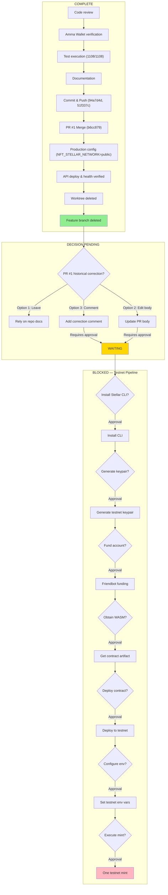

# Approval Gates and Loop

**Date:** 2026-08-19
**Updated:** Phase 4 (Post-Worktree-Cleanup)

```mermaid
flowchart TD
    subgraph "COMPLETE"
        R1["Code review"] --> R2["Amma Wallet verification"]
        R2 --> R3["Test execution (1108/1108)"]
        R3 --> R4["Documentation"]
        R4 --> R5["Commit & Push (94a7d4d, 51f337c)"]
        R5 --> R6["PR #1 Merge (b6cc879)"]
        R6 --> R7["Production config (NFT_STELLAR_NETWORK=public)"]
        R7 --> R8["API deploy & health verified"]
        R8 --> R9["Worktree deleted"]
        R9 --> R10["Feature branch deleted"]
    end

    subgraph "DECISION PENDING"
        R10 --> G1{"PR #1 historical correction?"}
        G1 -->|"Option 1: Leave"| D1["Rely on repo docs"]
        G1 -->|"Option 3: Comment"| D2["Add correction comment"]
        G1 -->|"Option 2: Edit body"| D3["Update PR body"]
        D2 -->|"Requires approval"| Wait1["WAITING"]
        D3 -->|"Requires approval"| Wait1
    end

    subgraph "BLOCKED — Testnet Pipeline"
        Wait1 --> G2{"Install Stellar CLI?"}
        G2 -->|"Approval"| T1["Install CLI"]
        T1 --> G3{"Generate keypair?"}
        G3 -->|"Approval"| T2["Generate testnet keypair"]
        T2 --> G4{"Fund account?"}
        G4 -->|"Approval"| T3["Friendbot funding"]
        T3 --> G5{"Obtain WASM?"}
        G5 -->|"Approval"| T4["Get contract artifact"]
        T4 --> G6{"Deploy contract?"}
        G6 -->|"Approval"| T5["Deploy to testnet"]
        T5 --> G7{"Configure env?"}
        G7 -->|"Approval"| T6["Set testnet env vars"]
        T6 --> G8{"Execute mint?"}
        G8 -->|"Approval"| T7["One testnet mint"]
    end

    style R10 fill:#90EE90
    style Wait1 fill:#FFD700
    style T7 fill:#FFB6C1
```
