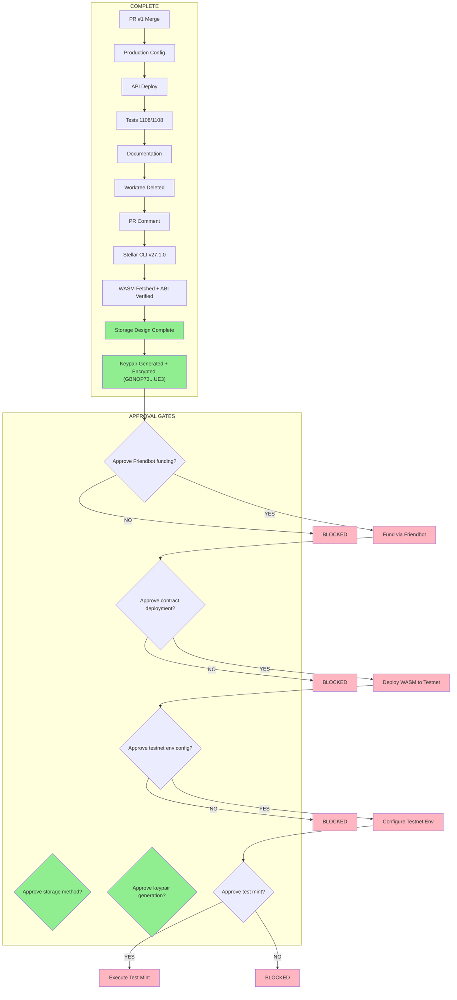

# Approval Gates and Loop

**Date:** 2026-08-19
**Updated:** Phase 9 (Post-Keypair Generation)

```mermaid
flowchart TD
    subgraph "COMPLETE"
        A1[PR #1 Merge] --> A2[Production Config]
        A2 --> A3[API Deploy]
        A3 --> A4[Tests 1108/1108]
        A4 --> A5[Documentation]
        A5 --> A6[Worktree Deleted]
        A6 --> A7[PR Comment]
        A7 --> A8[Stellar CLI v27.1.0]
        A8 --> A9[WASM Fetched + ABI Verified]
        A9 --> A10[Storage Design Complete]
        A10 --> GEN["Keypair Generated + Encrypted (GBNOP73...UE3)"]
    end

    subgraph "APPROVAL GATES"
        G1{Approve storage method?}
        G2{Approve keypair generation?}
        G3{Approve Friendbot funding?}
        G4{Approve contract deployment?}
        G5{Approve testnet env config?}
        G6{Approve test mint?}
    end

    GEN --> G3
    G3 -->|YES| FUND[Fund via Friendbot]
    G3 -->|NO| B3[BLOCKED]
    FUND --> G4
    G4 -->|YES| DEPLOY[Deploy WASM to Testnet]
    G4 -->|NO| B4[BLOCKED]
    DEPLOY --> G5
    G5 -->|YES| ENV[Configure Testnet Env]
    G5 -->|NO| B5[BLOCKED]
    ENV --> G6
    G6 -->|YES| MINT[Execute Test Mint]
    G6 -->|NO| B6[BLOCKED]

    style A10 fill:#90EE90
    style GEN fill:#90EE90
    style G1 fill:#90EE90
    style G2 fill:#90EE90
    style FUND fill:#FFB6C1
    style DEPLOY fill:#FFB6C1
    style ENV fill:#FFB6C1
    style MINT fill:#FFB6C1
    style B3 fill:#FFB6C1
    style B4 fill:#FFB6C1
    style B5 fill:#FFB6C1
    style B6 fill:#FFB6C1
```
