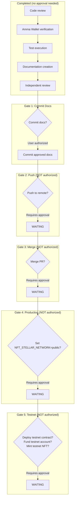

# Approval Gates and Loop

```mermaid
flowchart TD
    subgraph "Completed (no approval needed)"
        R1["Code review"] --> R2["Amma Wallet verification"]
        R2 --> R3["Test execution"]
        R3 --> R4["Documentation creation"]
        R4 --> R5["Independent review"]
    end

    subgraph "Gate 1: Commit Docs"
        R5 --> G1{"Commit docs?"}
        G1 -->|"User authorized"| Commit["Commit approved docs"]
    end

    subgraph "Gate 2: Push (NOT authorized)"
        Commit --> G2{"Push to remote?"}
        G2 -->|"Requires approval"| PushWait["WAITING"]
    end

    subgraph "Gate 3: Merge (NOT authorized)"
        PushWait --> G3{"Merge PR?"}
        G3 -->|"Requires approval"| MergeWait["WAITING"]
    end

    subgraph "Gate 4: Production (NOT authorized)"
        MergeWait --> G4{"Set NFT_STELLAR_NETWORK=public?"}
        G4 -->|"Requires approval"| EnvWait["WAITING"]
    end

    subgraph "Gate 5: Testnet (NOT authorized)"
        EnvWait --> G5{"Deploy testnet contract?<br/>Fund testnet account?<br/>Mint testnet NFT?"}
        G5 -->|"Requires approval"| TestWait["WAITING"]
    end
```
