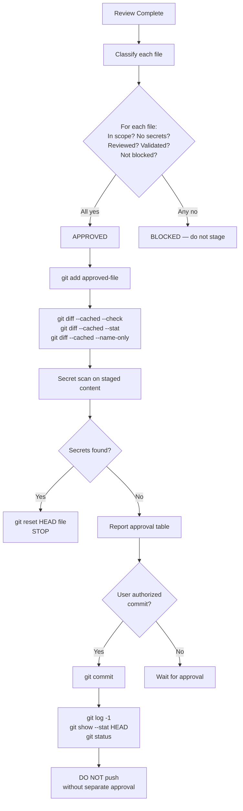

# Approved File Commit Flow

```mermaid
flowchart TD
    Start["Review Complete"] --> Classify["Classify each file"]
    Classify --> Check{"For each file:<br/>In scope? No secrets?<br/>Reviewed? Validated?<br/>Not blocked?"}
    Check -->|"All yes"| Approved["APPROVED"]
    Check -->|"Any no"| Blocked["BLOCKED — do not stage"]

    Approved --> Stage["git add approved-file"]
    Stage --> Verify["git diff --cached --check<br/>git diff --cached --stat<br/>git diff --cached --name-only"]
    Verify --> SecretScan["Secret scan on staged content"]
    SecretScan --> ScanResult{"Secrets found?"}
    ScanResult -->|Yes| Unstage["git reset HEAD file<br/>STOP"]
    ScanResult -->|No| Report["Report approval table"]
    Report --> UserApproval{"User authorized<br/>commit?"}
    UserApproval -->|Yes| Commit["git commit"]
    UserApproval -->|No| Wait["Wait for approval"]
    Commit --> PostCheck["git log -1<br/>git show --stat HEAD<br/>git status"]
    PostCheck --> NoPush["DO NOT push<br/>without separate approval"]
```
