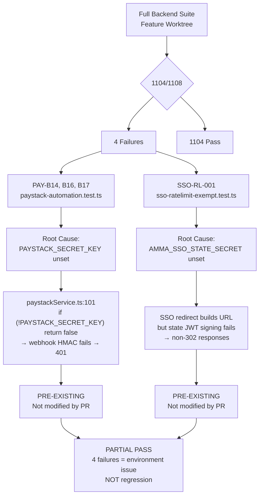

# Backend Test Debug Flow

```mermaid
flowchart TD
    Suite["Full Backend Suite<br/>Feature Worktree"] --> Result{"1104/1108"}
    Result --> Fails["4 Failures"]
    Result --> Pass["1104 Pass"]

    Fails --> PAY["PAY-B14, B16, B17<br/>paystack-automation.test.ts"]
    Fails --> SSO["SSO-RL-001<br/>sso-ratelimit-exempt.test.ts"]

    PAY --> PayCause["Root Cause:<br/>PAYSTACK_SECRET_KEY unset"]
    PayCause --> PayMech["paystackService.ts:101<br/>if (!PAYSTACK_SECRET_KEY) return false<br/>→ webhook HMAC fails → 401"]
    PayMech --> PayVerdict["PRE-EXISTING<br/>Not modified by PR"]

    SSO --> SSOCause["Root Cause:<br/>AMMA_SSO_STATE_SECRET unset"]
    SSOCause --> SSOMech["SSO redirect builds URL<br/>but state JWT signing fails<br/>→ non-302 responses"]
    SSOMech --> SSOVerdict["PRE-EXISTING<br/>Not modified by PR"]

    PayVerdict --> Conclusion["PARTIAL PASS<br/>4 failures = environment issue<br/>NOT regression"]
    SSOVerdict --> Conclusion
```
