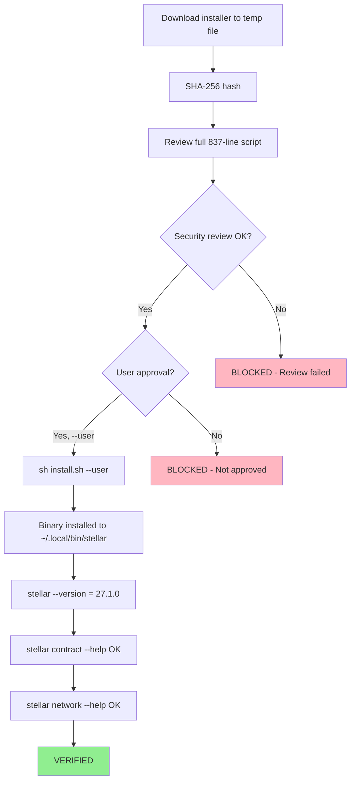

# CLI Installation Flow

**Date:** 2026-08-19
**Status:** COMPLETE

## Evidence
- Installer SHA-256: fc0dde4effffcd2859c1ec640967c398cc47e208dc1f55baf8aa1fc7cedcb12d
- Version: 27.1.0
- Path: /home/webadmin/.local/bin/stellar
