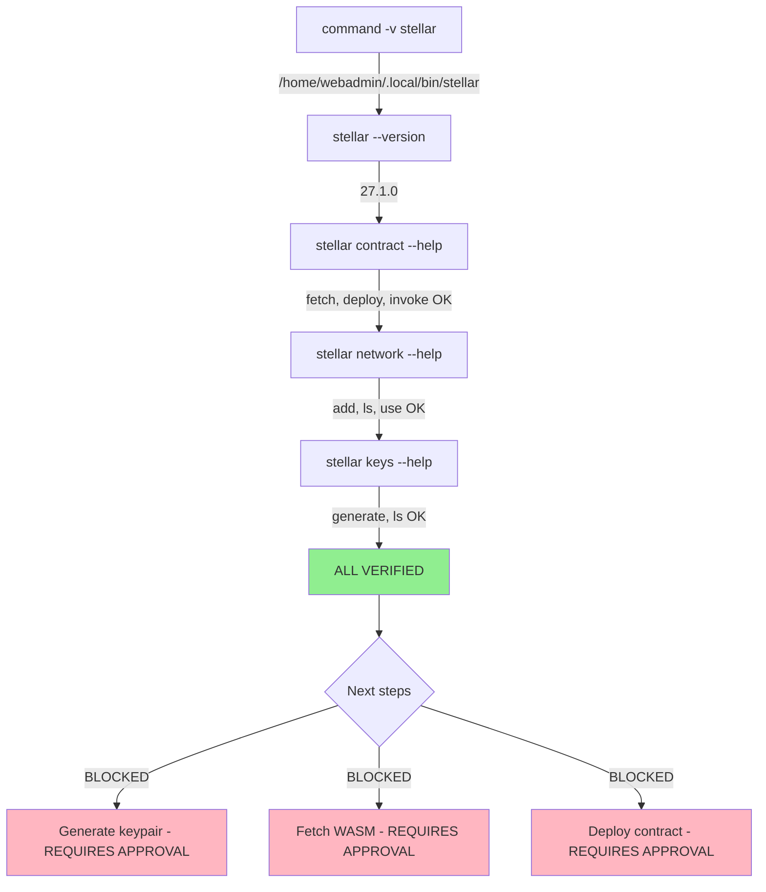

# CLI Verification Flow

**Date:** 2026-08-19
**Status:** VERIFIED

```mermaid
flowchart TD
    A["command -v stellar"] -->|"/home/webadmin/.local/bin/stellar"| B["stellar --version"]
    B -->|"27.1.0"| C["stellar contract --help"]
    C -->|"fetch, deploy, invoke OK"| D["stellar network --help"]
    D -->|"add, ls, use OK"| E["stellar keys --help"]
    E -->|"generate, ls OK"| F[ALL VERIFIED]

    F --> G{Next steps}
    G -->|BLOCKED| H[Generate keypair - REQUIRES APPROVAL]
    G -->|BLOCKED| I[Fetch WASM - REQUIRES APPROVAL]
    G -->|BLOCKED| J[Deploy contract - REQUIRES APPROVAL]

    style F fill:#90EE90
    style H fill:#FFB6C1
    style I fill:#FFB6C1
    style J fill:#FFB6C1
```
