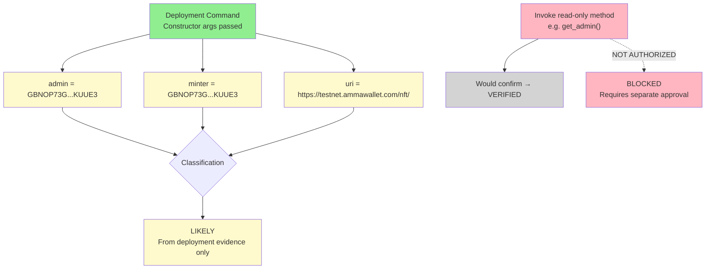

# Constructor Evidence Flow

**Date:** 2026-08-19

```mermaid
graph TD
    CMD["Deployment Command<br/>Constructor args passed"] --> ADMIN["admin = GBNOP73G...KUUE3"]
    CMD --> MINTER["minter = GBNOP73G...KUUE3"]
    CMD --> URI["uri = https://testnet.ammawallet.com/nft/"]

    ADMIN --> CLASS{"Classification"}
    MINTER --> CLASS
    URI --> CLASS

    CLASS --> LIKELY["LIKELY<br/>From deployment evidence only"]

    INVOKE["Invoke read-only method<br/>e.g. get_admin()"] --> VERIFY["Would confirm → VERIFIED"]
    INVOKE -.->|"NOT AUTHORIZED"| BLOCKED["BLOCKED<br/>Requires separate approval"]

    style CMD fill:#90EE90
    style ADMIN fill:#FFFACD
    style MINTER fill:#FFFACD
    style URI fill:#FFFACD
    style LIKELY fill:#FFFACD
    style INVOKE fill:#FFB6C1
    style BLOCKED fill:#FFB6C1
    style VERIFY fill:#D3D3D3
```
