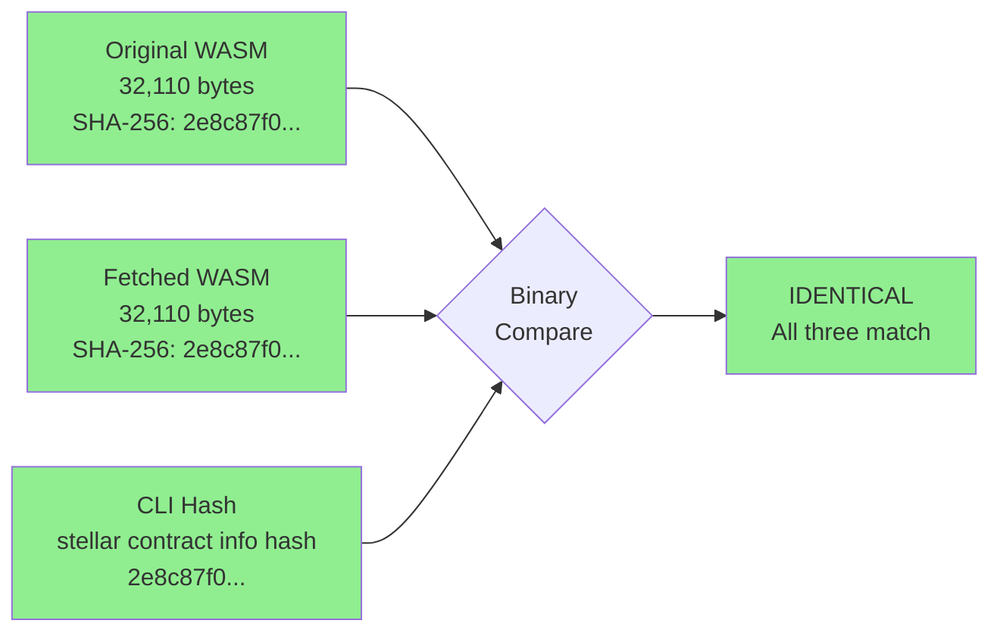

# Contract Code Hash Verification Flow

**Date:** 2026-08-19

```mermaid
graph LR
    ORIG["Original WASM<br/>32,110 bytes<br/>SHA-256: 2e8c87f0..."] --> COMPARE{"Binary<br/>Compare"}
    FETCHED["Fetched WASM<br/>32,110 bytes<br/>SHA-256: 2e8c87f0..."] --> COMPARE
    CLI_HASH["CLI Hash<br/>stellar contract info hash<br/>2e8c87f0..."] --> COMPARE
    COMPARE --> IDENTICAL["IDENTICAL<br/>All three match"]

    style ORIG fill:#90EE90
    style FETCHED fill:#90EE90
    style CLI_HASH fill:#90EE90
    style IDENTICAL fill:#90EE90
```
