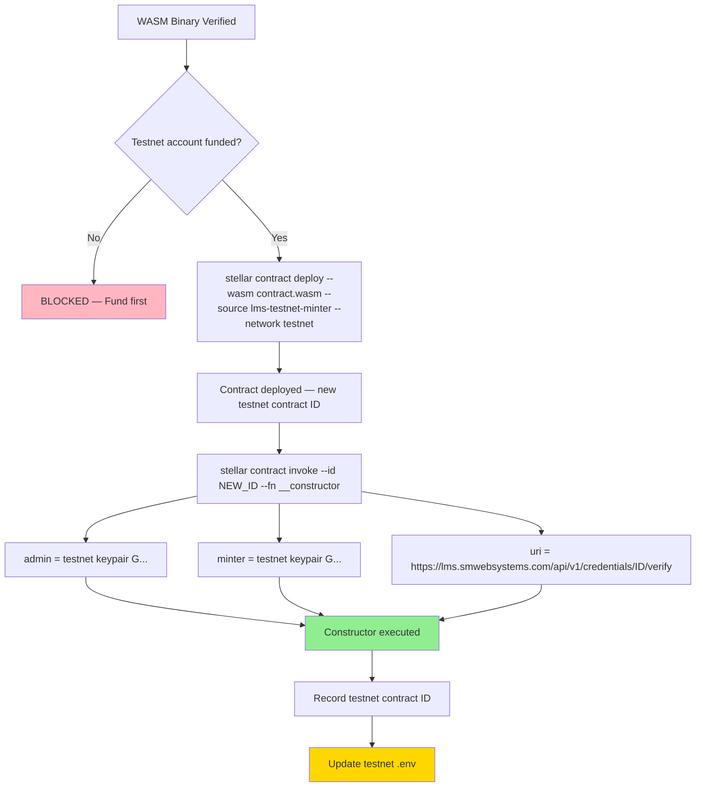

# Contract Constructor Flow

**Date:** 2026-08-19
**Status:** BLOCKED — Requires deployment approval

```mermaid
flowchart TD
    A[WASM Binary Verified] --> B{Testnet account funded?}
    B -->|No| C[BLOCKED — Fund first]
    B -->|Yes| D["stellar contract deploy --wasm contract.wasm --source lms-testnet-minter --network testnet"]
    D --> E[Contract deployed — new testnet contract ID]
    E --> F["stellar contract invoke --id NEW_ID --fn __constructor"]
    F --> G["admin = testnet keypair G..."]
    F --> H["minter = testnet keypair G..."]
    F --> I["uri = https://lms.smwebsystems.com/api/v1/credentials/ID/verify"]
    G & H & I --> J[Constructor executed]
    J --> K[Record testnet contract ID]
    K --> L[Update testnet .env]

    style C fill:#FFB6C1
    style J fill:#90EE90
    style L fill:#FFD700
```
