# Dependency Map

**Date:** 2026-08-19
**Updated:** Phase 13 (Friendbot Funding RECONCILED — 19,997.8 XLM)

## Task Dependencies

```mermaid
graph LR
    subgraph "COMPLETE"
        PR["PR #1 Merge"] --> PROD["Production Config"]
        PROD --> DEPLOY["API Deploy"]
        DEPLOY --> TESTS["Tests 1108/1108"]
        TESTS --> DOCS["Documentation"]
        DOCS --> WT["Worktree Deleted"]
        WT --> PRCORR["PR Comment"]
        PRCORR --> CLI["Stellar CLI v27.1.0"]
        CLI -->|"stellar contract fetch"| WASM["WASM Fetched + ABI Verified"]
        WASM --> STORAGE["Storage Design"]
        STORAGE --> KEYPAIR["Keypair Generated"]
    end

    subgraph "INCIDENT RESPONSE — RESOLVED"
        ROTATION["Passphrase Rotation"]
        ROTFIX["Script Fixed + Executed"]
        ROTVERIFY["Rotation VERIFIED"]
    end

    subgraph "FUNDED — RECONCILED"
        FUND["Funded 19,997.8 XLM\n2x Friendbot VERIFIED"]
    end

    subgraph "BLOCKED — Next Steps"
        CONTRACT["Deploy Contract"] --> ENV["Configure Testnet"]
        ENV --> MINT["Execute Mint"]
        MINT --> EXPLORER["Verify on Explorer"]
    end

    KEYPAIR --> ROTATION
    ROTATION --> ROTFIX
    ROTFIX --> ROTVERIFY
    ROTVERIFY --> FUND
    FUND -->|"Deployment requires approval"| CONTRACT
    WASM -->|"deploy with constructor"| CONTRACT

    style CLI fill:#90EE90
    style WASM fill:#90EE90
    style STORAGE fill:#90EE90
    style KEYPAIR fill:#90EE90
    style ROTATION fill:#90EE90
    style ROTFIX fill:#90EE90
    style ROTVERIFY fill:#90EE90
    style FUND fill:#90EE90
    style CONTRACT fill:#FFB6C1
    style ENV fill:#FFB6C1
    style MINT fill:#FFB6C1
    style EXPLORER fill:#FFB6C1
```

## Legend

| Color | Meaning |
|-------|---------|
| Green | COMPLETE |
| Yellow | BLOCKED (approval pending, read-only possible) |
| Red | BLOCKED (multiple approvals + prerequisites needed) |
