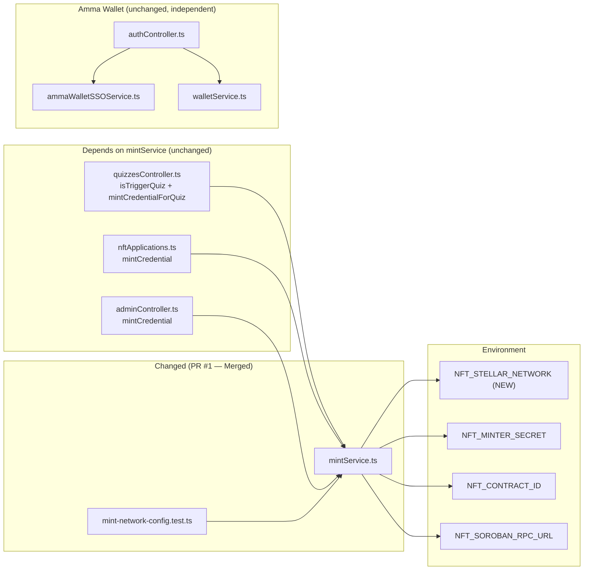
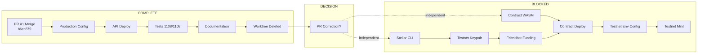

# Dependency Map

**Date:** 2026-08-19
**Updated:** Phase 4 (Post-Worktree-Cleanup)

## Code Dependencies

## Task Dependencies

## Legend

| Color | Meaning |
|-------|---------|
| Complete | All P1 tasks done |
| Decision | PR correction method |
| Blocked | Testnet pipeline (each step requires approval) |
