# Dependency Map

**Date:** 2026-08-19
**Updated:** Phase 5 (Testnet Tooling)

## Task Dependencies

```mermaid
graph LR
    subgraph "COMPLETE"
        PR["PR #1 Merge"] --> PROD["Production Config"]
        PROD --> DEPLOY["API Deploy"]
        DEPLOY --> TESTS["Tests 1108/1108"]
        TESTS --> DOCS["Documentation"]
        DOCS --> WT["Worktree Deleted"]
        WT --> PRCORR["PR Comment Posted"]
        PRCORR --> PREFLIGHT["Testnet Preflight"]
    end

    subgraph "BLOCKED — Tooling"
        CLI["Stellar CLI Install"] --> WASM_FETCH["Fetch WASM"]
        CLI --> KEYPAIR["Generate Keypair"]
    end

    subgraph "BLOCKED — Testnet Pipeline"
        KEYPAIR --> FUND["Friendbot Funding"]
        WASM_FETCH --> CONTRACT["Deploy Contract"]
        FUND --> CONTRACT
        CONTRACT --> ENV["Testnet Env Config"]
        ENV --> MINT["Testnet Mint"]
    end

    PREFLIGHT -.->|"next"| CLI

    style PRCORR fill:#90EE90
    style PREFLIGHT fill:#90EE90
    style CLI fill:#FFD700
    style WASM_FETCH fill:#FFD700
    style KEYPAIR fill:#FFB6C1
    style FUND fill:#FFB6C1
    style CONTRACT fill:#FFB6C1
    style ENV fill:#FFB6C1
    style MINT fill:#FFB6C1
```

## Legend

| Color | Meaning |
|-------|---------|
| Green | COMPLETE |
| Yellow | BLOCKED (approval pending) |
| Red | BLOCKED (multiple approvals needed) |
