# Dependency Map

**Date:** 2026-08-19
**Updated:** Phase 17 (Post-Mint Verified — 18/18 PASS, Token #0 Minted)

## Task Dependencies

```mermaid
graph LR
    subgraph "COMPLETE"
        PR["PR #1 Merge"] --> PROD["Production Config"]
        PROD --> DEPLOY_API["API Deploy"]
        DEPLOY_API --> TESTS["Tests 1108/1108"]
        TESTS --> DOCS["Documentation"]
        DOCS --> WT["Worktree Deleted"]
        WT --> PRCORR["PR Comment"]
        PRCORR --> CLI["Stellar CLI v27.1.0"]
        CLI -->|"stellar contract fetch"| WASM["WASM Fetched + ABI Verified"]
        WASM --> STORAGE["Storage Design"]
        STORAGE --> KEYPAIR["Keypair Generated"]
    end

    subgraph "INCIDENT RESPONSE — RESOLVED"
        ROTATION["Passphrase Rotation"]
        ROTFIX["Script Fixed + Executed"]
        ROTVERIFY["Rotation VERIFIED"]
    end

    subgraph "FUNDED — RECONCILED"
        FUND["Funded 19,997.8 XLM\n2x Friendbot VERIFIED"]
    end

    subgraph "DEPLOYED — VERIFIED"
        CONTRACT["Contract Deployed\nCAJ74ZCQ...THRB"]
        TX_VERIFY["Transaction VERIFIED\nLedger 4226582"]
        CODE_VERIFY["Code Hash VERIFIED\nSHA-256 match"]
        NO_ACTIVITY["No Unauthorized Activity\nVERIFIED"]
    end

    subgraph "ENV + RUNTIME — VERIFIED"
        ENV["Testnet Env Created\n.env.testnet-nft"]
        API_TEST["API Runtime Verified\nPort 3003, testnet config"]
    end

    subgraph "ASSESSMENT — COMPLETE"
        ASSESS["Repository Assessment\n24/24 PASS"]
        SAFEGUARDS["Safeguard Inventory\n6 categories STRONG/ADEQUATE"]
        DOCS16["16 Assessment Docs\n4 specs + 4 plans + 8 diagrams"]
    end

    subgraph "STAGES A-C — COMPLETE"
        READ["Stage A: Read Contract\nConstructor VERIFIED"]
        SIM["Stage B: Simulation\n--send=no SUCCESS"]
        MINT["Stage C: One Mint\ntx 05e459cc...44b2"]
        PMVERIFY["Post-Mint Verified\n18/18 PASS"]
    end

    subgraph "INTEGRATION — REQUIRES APPROVAL"
        META["Metadata JSON Endpoint"]
        RECON["Timeout Reconciliation"]
        FILTER["Admin UI Network Filter"]
        RPCTESTS["Real-RPC Integration Tests"]
        PRODREADY["Production Readiness Review"]
    end

    KEYPAIR --> ROTATION
    ROTATION --> ROTFIX
    ROTFIX --> ROTVERIFY
    ROTVERIFY --> FUND
    FUND --> CONTRACT
    WASM --> CONTRACT
    CONTRACT --> TX_VERIFY
    CONTRACT --> CODE_VERIFY
    CONTRACT --> NO_ACTIVITY
    TX_VERIFY --> ENV
    CODE_VERIFY --> ENV
    NO_ACTIVITY --> ENV
    ENV --> API_TEST
    API_TEST --> ASSESS
    ASSESS --> SAFEGUARDS
    SAFEGUARDS --> DOCS16
    DOCS16 --> READ
    READ --> SIM
    SIM --> MINT
    MINT --> PMVERIFY
    PMVERIFY --> META
    PMVERIFY --> RECON
    PMVERIFY --> FILTER
    PMVERIFY --> RPCTESTS
    META --> PRODREADY
    RECON --> PRODREADY
    FILTER --> PRODREADY
    RPCTESTS --> PRODREADY

    style CLI fill:#90EE90
    style WASM fill:#90EE90
    style STORAGE fill:#90EE90
    style KEYPAIR fill:#90EE90
    style ROTATION fill:#90EE90
    style ROTFIX fill:#90EE90
    style ROTVERIFY fill:#90EE90
    style FUND fill:#90EE90
    style CONTRACT fill:#90EE90
    style TX_VERIFY fill:#90EE90
    style CODE_VERIFY fill:#90EE90
    style NO_ACTIVITY fill:#90EE90
    style ENV fill:#90EE90
    style API_TEST fill:#90EE90
    style ASSESS fill:#90EE90
    style SAFEGUARDS fill:#90EE90
    style DOCS16 fill:#90EE90
    style READ fill:#90EE90
    style SIM fill:#90EE90
    style MINT fill:#90EE90
    style PMVERIFY fill:#90EE90
    style META fill:#FFD700
    style RECON fill:#FFD700
    style FILTER fill:#FFD700
    style RPCTESTS fill:#FFD700
    style PRODREADY fill:#FFB6C1
```

## Legend

| Color | Meaning |
|-------|---------|
| Green | COMPLETE / VERIFIED |
| Yellow | LIKELY (evidence-based, not invocation-confirmed) |
| Red/Pink | BLOCKED (approval required) |
| Gray | NOT YET REACHED |
