# Dependency Map

**Date:** 2026-08-19
**Updated:** Phase 14 (Contract Deployed & Verified — CAJ74ZCQ...THRB)

## Task Dependencies

```mermaid
graph LR
    subgraph "COMPLETE"
        PR["PR #1 Merge"] --> PROD["Production Config"]
        PROD --> DEPLOY_API["API Deploy"]
        DEPLOY_API --> TESTS["Tests 1108/1108"]
        TESTS --> DOCS["Documentation"]
        DOCS --> WT["Worktree Deleted"]
        WT --> PRCORR["PR Comment"]
        PRCORR --> CLI["Stellar CLI v27.1.0"]
        CLI -->|"stellar contract fetch"| WASM["WASM Fetched + ABI Verified"]
        WASM --> STORAGE["Storage Design"]
        STORAGE --> KEYPAIR["Keypair Generated"]
    end

    subgraph "INCIDENT RESPONSE — RESOLVED"
        ROTATION["Passphrase Rotation"]
        ROTFIX["Script Fixed + Executed"]
        ROTVERIFY["Rotation VERIFIED"]
    end

    subgraph "FUNDED — RECONCILED"
        FUND["Funded 19,997.8 XLM\n2x Friendbot VERIFIED"]
    end

    subgraph "DEPLOYED — VERIFIED"
        CONTRACT["Contract Deployed\nCAJ74ZCQ...THRB"]
        TX_VERIFY["Transaction VERIFIED\nLedger 4226582"]
        CODE_VERIFY["Code Hash VERIFIED\nSHA-256 match"]
        NO_ACTIVITY["No Unauthorized Activity\nVERIFIED"]
    end

    subgraph "BLOCKED — Next Steps"
        ENV["Configure Testnet Env"] --> API_TEST["Run API Testnet"]
        API_TEST --> SMOKE["Smoke Test"]
        SMOKE --> MINT["Execute Mint"]
        MINT --> EXPLORER["Verify on Explorer"]
    end

    KEYPAIR --> ROTATION
    ROTATION --> ROTFIX
    ROTFIX --> ROTVERIFY
    ROTVERIFY --> FUND
    FUND --> CONTRACT
    WASM --> CONTRACT
    CONTRACT --> TX_VERIFY
    CONTRACT --> CODE_VERIFY
    CONTRACT --> NO_ACTIVITY
    TX_VERIFY -->|"Requires approval"| ENV
    CODE_VERIFY --> ENV
    NO_ACTIVITY --> ENV

    style CLI fill:#90EE90
    style WASM fill:#90EE90
    style STORAGE fill:#90EE90
    style KEYPAIR fill:#90EE90
    style ROTATION fill:#90EE90
    style ROTFIX fill:#90EE90
    style ROTVERIFY fill:#90EE90
    style FUND fill:#90EE90
    style CONTRACT fill:#90EE90
    style TX_VERIFY fill:#90EE90
    style CODE_VERIFY fill:#90EE90
    style NO_ACTIVITY fill:#90EE90
    style ENV fill:#FFB6C1
    style API_TEST fill:#FFB6C1
    style SMOKE fill:#FFB6C1
    style MINT fill:#FFB6C1
    style EXPLORER fill:#FFB6C1
```

## Legend

| Color | Meaning |
|-------|---------|
| Green | COMPLETE / VERIFIED |
| Yellow | LIKELY (evidence-based, not invocation-confirmed) |
| Red/Pink | BLOCKED (approval required) |
| Gray | NOT YET REACHED |
