# Dependency Map

**Date:** 2026-08-19
**Updated:** Phase 6 (Post-CLI Installation)

## Task Dependencies

```mermaid
graph LR
    subgraph "COMPLETE"
        PR["PR #1 Merge"] --> PROD["Production Config"]
        PROD --> DEPLOY["API Deploy"]
        DEPLOY --> TESTS["Tests 1108/1108"]
        TESTS --> DOCS["Documentation"]
        DOCS --> WT["Worktree Deleted"]
        WT --> PRCORR["PR Comment"]
        PRCORR --> CLI["Stellar CLI v27.1.0"]
    end

    subgraph "BLOCKED — Next Steps"
        WASM["Fetch WASM"] --> CONTRACT["Deploy Contract"]
        KEYPAIR["Generate Keypair"] --> FUND["Fund Account"]
        FUND --> CONTRACT
        CONTRACT --> ENV["Configure Testnet"]
        ENV --> MINT["Execute Mint"]
    end

    CLI -->|"stellar contract fetch"| WASM
    CLI -->|"stellar keys generate"| KEYPAIR

    style CLI fill:#90EE90
    style WASM fill:#FFD700
    style KEYPAIR fill:#FFB6C1
    style FUND fill:#FFB6C1
    style CONTRACT fill:#FFB6C1
    style ENV fill:#FFB6C1
    style MINT fill:#FFB6C1
```

## Legend

| Color | Meaning |
|-------|---------|
| Green | COMPLETE |
| Yellow | BLOCKED (approval pending, read-only possible) |
| Red | BLOCKED (multiple approvals + prerequisites needed) |
