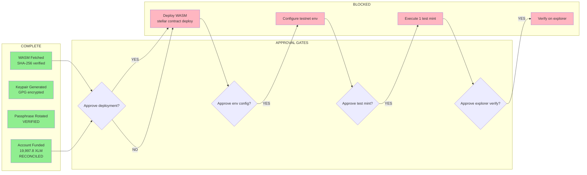

# Deployment Approval Gates

**Date:** 2026-08-19

```mermaid
flowchart LR
    subgraph "COMPLETE"
        WASM["WASM Fetched\nSHA-256 verified"]
        KEYPAIR["Keypair Generated\nGPG encrypted"]
        ROTATION["Passphrase Rotated\nVERIFIED"]
        FUNDING["Account Funded\n19,997.8 XLM\nRECONCILED"]
    end

    subgraph "APPROVAL GATES"
        G1{"Approve deployment?"}
        G2{"Approve env config?"}
        G3{"Approve test mint?"}
        G4{"Approve explorer verify?"}
    end

    subgraph "BLOCKED"
        DEPLOY["Deploy WASM\nstellar contract deploy"]
        ENV["Configure testnet env"]
        MINT["Execute 1 test mint"]
        EXPLORER["Verify on explorer"]
    end

    WASM --> G1
    FUNDING --> G1
    G1 -->|YES| DEPLOY
    G1 -->|NO| DEPLOY
    DEPLOY --> G2
    G2 -->|YES| ENV
    ENV --> G3
    G3 -->|YES| MINT
    MINT --> G4
    G4 -->|YES| EXPLORER

    style WASM fill:#90EE90
    style KEYPAIR fill:#90EE90
    style ROTATION fill:#90EE90
    style FUNDING fill:#90EE90
    style DEPLOY fill:#FFB6C1
    style ENV fill:#FFB6C1
    style MINT fill:#FFB6C1
    style EXPLORER fill:#FFB6C1
```
