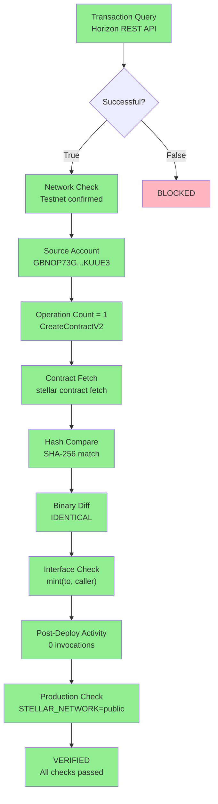

# Deployment Verification Flow

**Date:** 2026-08-19

```mermaid
graph TD
    TX["Transaction Query<br/>Horizon REST API"] --> TX_OK{"Successful?"}
    TX_OK -->|"True"| NET["Network Check<br/>Testnet confirmed"]
    TX_OK -->|"False"| BLOCKED["BLOCKED"]
    NET --> SRC["Source Account<br/>GBNOP73G...KUUE3"]
    SRC --> OPS["Operation Count = 1<br/>CreateContractV2"]
    OPS --> FETCH["Contract Fetch<br/>stellar contract fetch"]
    FETCH --> HASH["Hash Compare<br/>SHA-256 match"]
    HASH --> DIFF["Binary Diff<br/>IDENTICAL"]
    DIFF --> IFACE["Interface Check<br/>mint(to, caller)"]
    IFACE --> ACTIVITY["Post-Deploy Activity<br/>0 invocations"]
    ACTIVITY --> PROD["Production Check<br/>STELLAR_NETWORK=public"]
    PROD --> VERIFIED["VERIFIED<br/>All checks passed"]

    style TX fill:#90EE90
    style NET fill:#90EE90
    style SRC fill:#90EE90
    style OPS fill:#90EE90
    style FETCH fill:#90EE90
    style HASH fill:#90EE90
    style DIFF fill:#90EE90
    style IFACE fill:#90EE90
    style ACTIVITY fill:#90EE90
    style PROD fill:#90EE90
    style VERIFIED fill:#90EE90
    style BLOCKED fill:#FFB6C1
```
