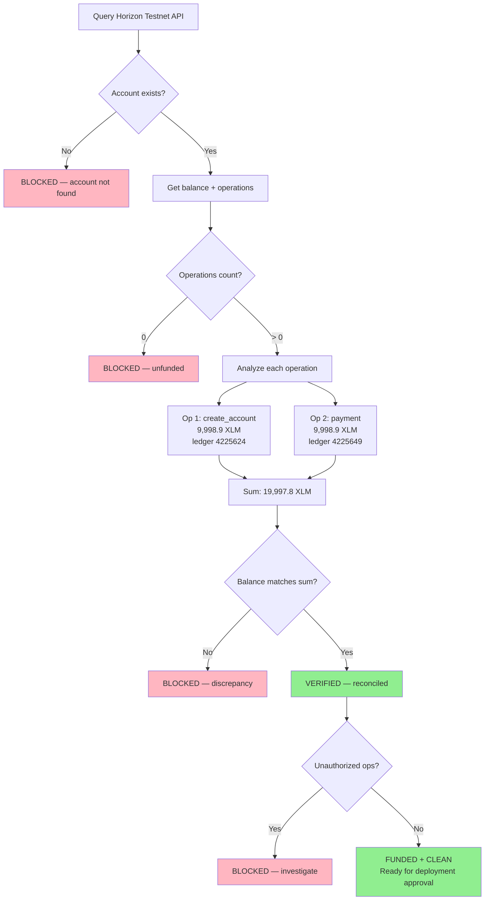

# Double Funding Reconciliation Flow

**Date:** 2026-08-19

```mermaid
flowchart TD
    A["Query Horizon Testnet API"] --> B{"Account exists?"}
    B -->|No| C["BLOCKED — account not found"]
    B -->|Yes| D["Get balance + operations"]
    D --> E{"Operations count?"}
    E -->|0| F["BLOCKED — unfunded"]
    E -->|"> 0"| G["Analyze each operation"]
    G --> H["Op 1: create_account\n9,998.9 XLM\nledger 4225624"]
    G --> I["Op 2: payment\n9,998.9 XLM\nledger 4225649"]
    H --> J["Sum: 19,997.8 XLM"]
    I --> J
    J --> K{"Balance matches sum?"}
    K -->|No| L["BLOCKED — discrepancy"]
    K -->|Yes| M["VERIFIED — reconciled"]
    M --> N{"Unauthorized ops?"}
    N -->|Yes| O["BLOCKED — investigate"]
    N -->|No| P["FUNDED + CLEAN\nReady for deployment approval"]

    style C fill:#FFB6C1
    style F fill:#FFB6C1
    style L fill:#FFB6C1
    style O fill:#FFB6C1
    style M fill:#90EE90
    style P fill:#90EE90
```
