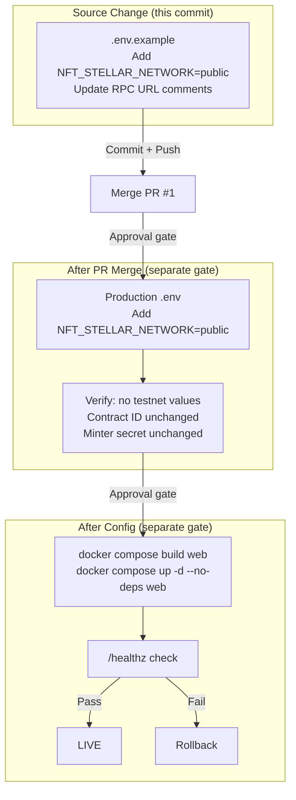

# Environment Configuration Flow

```mermaid
flowchart TD
    subgraph "Source Change (this commit)"
        EnvExample[".env.example<br/>Add NFT_STELLAR_NETWORK=public<br/>Update RPC URL comments"]
    end

    subgraph "After PR Merge (separate gate)"
        ProdEnv["Production .env<br/>Add NFT_STELLAR_NETWORK=public"]
        ProdEnv --> Verify["Verify: no testnet values<br/>Contract ID unchanged<br/>Minter secret unchanged"]
    end

    subgraph "After Config (separate gate)"
        Deploy["docker compose build web<br/>docker compose up -d --no-deps web"]
        Deploy --> Health["/healthz check"]
        Health -->|Pass| Live["LIVE"]
        Health -->|Fail| Rollback["Rollback"]
    end

    EnvExample -->|"Commit + Push"| Merge["Merge PR #1"]
    Merge -->|"Approval gate"| ProdEnv
    Verify -->|"Approval gate"| Deploy
```
