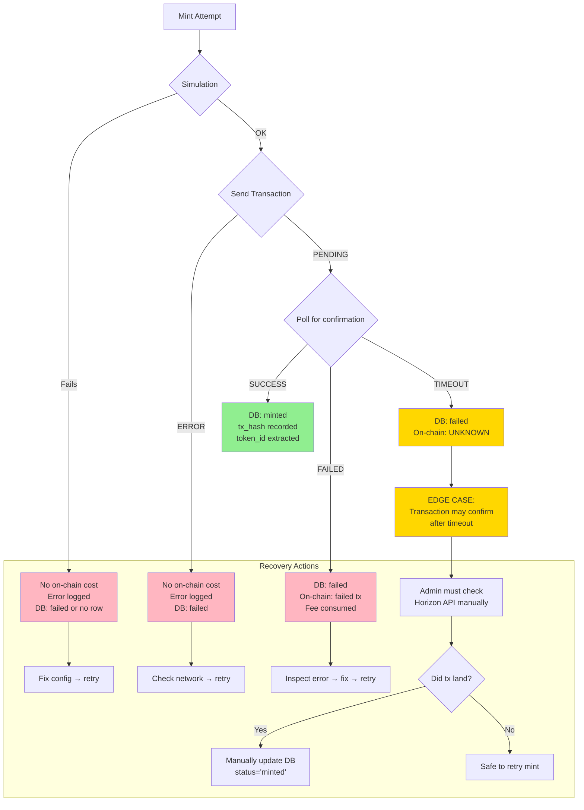

# Failure Recovery Flow

**Date:** 2026-08-19

```mermaid
graph TD
    MINT[Mint Attempt] --> SIM{Simulation}
    SIM -->|Fails| SIM_ERR[No on-chain cost<br/>Error logged<br/>DB: failed or no row]
    SIM -->|OK| SEND{Send Transaction}
    SEND -->|ERROR| SEND_ERR[No on-chain cost<br/>Error logged<br/>DB: failed]
    SEND -->|PENDING| POLL{Poll for confirmation}
    POLL -->|SUCCESS| SUCCESS[DB: minted<br/>tx_hash recorded<br/>token_id extracted]
    POLL -->|FAILED| TX_FAIL[DB: failed<br/>On-chain: failed tx<br/>Fee consumed]
    POLL -->|TIMEOUT| TIMEOUT[DB: failed<br/>On-chain: UNKNOWN]

    TIMEOUT --> EDGE[EDGE CASE:<br/>Transaction may confirm<br/>after timeout]
    EDGE --> MANUAL[Admin must check<br/>Horizon API manually]

    subgraph "Recovery Actions"
        SIM_ERR --> RETRY1[Fix config → retry]
        SEND_ERR --> RETRY2[Check network → retry]
        TX_FAIL --> RETRY3[Inspect error → fix → retry]
        MANUAL --> CHECK{Did tx land?}
        CHECK -->|Yes| FIX_DB[Manually update DB<br/>status='minted']
        CHECK -->|No| RETRY4[Safe to retry mint]
    end

    style SUCCESS fill:#90EE90
    style SIM_ERR fill:#FFB6C1
    style SEND_ERR fill:#FFB6C1
    style TX_FAIL fill:#FFB6C1
    style TIMEOUT fill:#FFD700
    style EDGE fill:#FFD700
```
