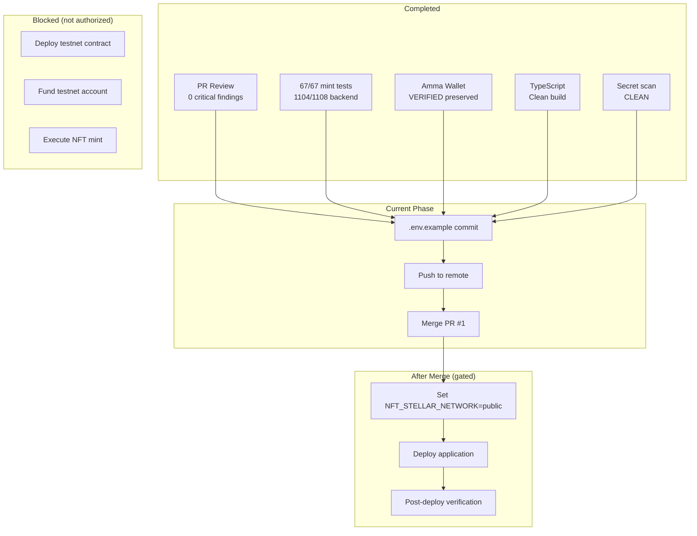

# Final PR Release Context

```mermaid
graph TB
    subgraph "Completed"
        Review["PR Review<br/>0 critical findings"]
        Tests["67/67 mint tests<br/>1104/1108 backend"]
        AW["Amma Wallet<br/>VERIFIED preserved"]
        TS["TypeScript<br/>Clean build"]
        Scan["Secret scan<br/>CLEAN"]
    end

    subgraph "Current Phase"
        Commit[".env.example commit"]
        Push["Push to remote"]
        Merge["Merge PR #1"]
    end

    subgraph "After Merge (gated)"
        Config["Set NFT_STELLAR_NETWORK=public"]
        Deploy["Deploy application"]
        Verify["Post-deploy verification"]
    end

    subgraph "Blocked (not authorized)"
        Contract["Deploy testnet contract"]
        Fund["Fund testnet account"]
        Mint["Execute NFT mint"]
    end

    Review --> Commit
    Tests --> Commit
    AW --> Commit
    TS --> Commit
    Scan --> Commit
    Commit --> Push
    Push --> Merge
    Merge --> Config
    Config --> Deploy
    Deploy --> Verify
```
