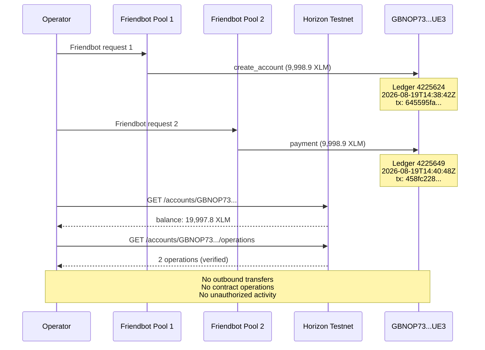

# Funding History Flow

**Date:** 2026-08-19

```mermaid
sequenceDiagram
    participant User as Operator
    participant FB1 as Friendbot Pool 1
    participant FB2 as Friendbot Pool 2
    participant Horizon as Horizon Testnet
    participant Account as GBNOP73...UE3

    User->>FB1: Friendbot request 1
    FB1->>Account: create_account (9,998.9 XLM)
    Note over Account: Ledger 4225624<br/>2026-08-19T14:38:42Z<br/>tx: 645595fa...

    User->>FB2: Friendbot request 2
    FB2->>Account: payment (9,998.9 XLM)
    Note over Account: Ledger 4225649<br/>2026-08-19T14:40:48Z<br/>tx: 458fc228...

    User->>Horizon: GET /accounts/GBNOP73...
    Horizon-->>User: balance: 19,997.8 XLM
    User->>Horizon: GET /accounts/GBNOP73.../operations
    Horizon-->>User: 2 operations (verified)

    Note over User,Account: No outbound transfers<br/>No contract operations<br/>No unauthorized activity
```
