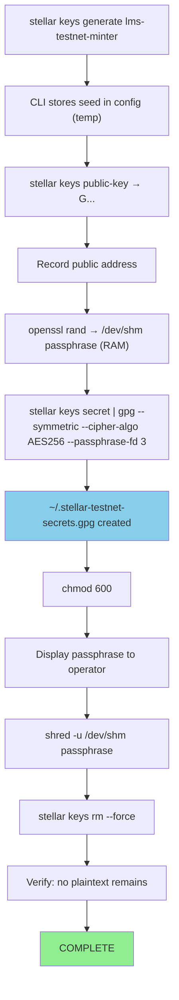

# GPG Encryption Flow

**Date:** 2026-08-19
**Status:** COMPLETE

```mermaid
flowchart TD
    A["stellar keys generate lms-testnet-minter"] --> B["CLI stores seed in config (temp)"]
    B --> C["stellar keys public-key → G..."]
    C --> D["Record public address"]
    D --> E["openssl rand → /dev/shm passphrase (RAM)"]
    E --> F["stellar keys secret | gpg --symmetric --cipher-algo AES256 --passphrase-fd 3"]
    F --> G["~/.stellar-testnet-secrets.gpg created"]
    G --> H["chmod 600"]
    H --> I["Display passphrase to operator"]
    I --> J["shred -u /dev/shm passphrase"]
    J --> K["stellar keys rm --force"]
    K --> L["Verify: no plaintext remains"]
    L --> M[COMPLETE]

    style M fill:#90EE90
    style G fill:#87CEEB
```
