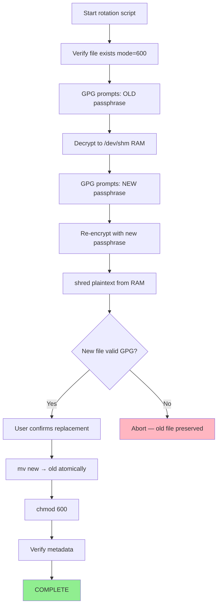

# GPG Passphrase Rotation Flow

**Date:** 2026-08-19
**Script:** `~/scripts/rotate-testnet-gpg-passphrase.sh`

## Security Properties

| Property | Implementation |
|----------|----------------|
| Passphrase never a CLI arg | Prompted interactively by GPG |
| Plaintext never on disk | Written only to `/dev/shm` (RAM tmpfs) |
| Plaintext shredded after use | `shred -u` on tmpdir contents |
| Atomic replacement | `mv` — no window where file is absent |
| Permissions preserved | `chmod 600` enforced after `mv` |
| Abort-safe | Old file untouched until user confirms |

## Notes

- The OLD passphrase is accepted by GPG interactively — it is never passed as
  an argument, stored in a variable, or visible in `ps` output.
- `/dev/shm` is a RAM-backed tmpfs on Linux. Contents survive only until shred
  or reboot. The script shreds immediately after re-encryption.
- If the script is interrupted before node I (user confirmation), the original
  `.gpg` file is left unchanged.
