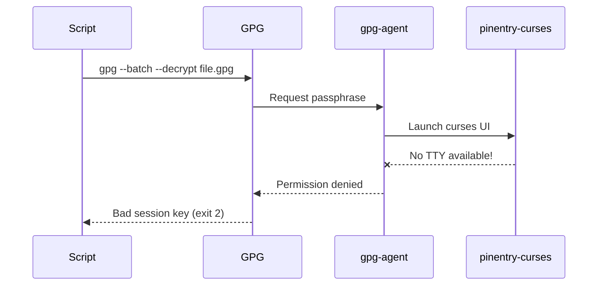
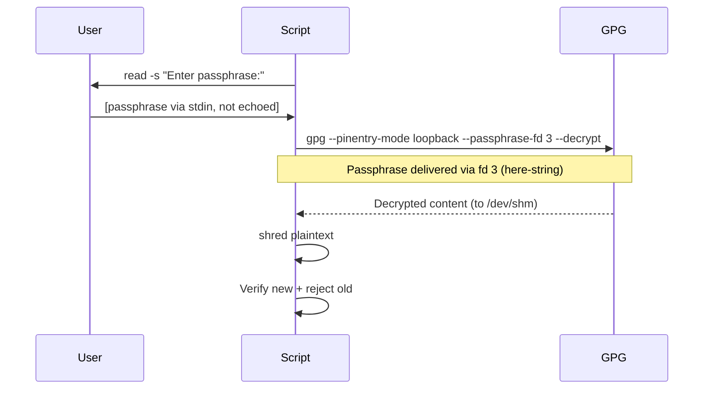

# GPG Rotation Fix — Passphrase Flow

**Date:** 2026-08-19

## Before Fix (FAILED)

## After Fix (WORKING)

## Key Difference
| Aspect | Before | After |
|--------|--------|-------|
| Passphrase input | pinentry-curses (needs TTY) | bash `read -s` (works in any terminal) |
| GPG passphrase delivery | Agent → pinentry subprocess | `--passphrase-fd 3` (direct fd) |
| TTY requirement | YES (pinentry-curses) | NO (loopback mode) |
| Confirmation | None | Enter twice + match check |
| Post-rotation verify | Manual (user runs gpg --decrypt) | Automated (script tests both passphrases) |
