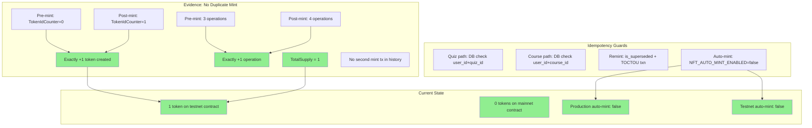

# Idempotency and No-Duplicate-Mint Verification

**Date:** 2026-08-19

```mermaid
graph TD
    subgraph "Evidence: No Duplicate Mint"
        E1[Pre-mint: TokenIdCounter=0]
        E2[Post-mint: TokenIdCounter=1]
        E3[Exactly +1 token created]
        E4[Pre-mint: 3 operations]
        E5[Post-mint: 4 operations]
        E6[Exactly +1 operation]
        E7[TotalSupply = 1]
        E8[No second mint tx in history]
    end

    subgraph "Idempotency Guards"
        IG1[Quiz path: DB check user_id+quiz_id]
        IG2[Course path: DB check user_id+course_id]
        IG3[Remint: is_superseded + TOCTOU txn]
        IG4[Auto-mint: NFT_AUTO_MINT_ENABLED=false]
    end

    subgraph "Current State"
        S1[1 token on testnet contract]
        S2[0 tokens on mainnet contract]
        S3[Production auto-mint: false]
        S4[Testnet auto-mint: false]
    end

    E1 --> E3
    E2 --> E3
    E4 --> E6
    E5 --> E6
    E3 --> S1
    E7 --> S1
    IG4 --> S3
    IG4 --> S4

    style E3 fill:#90EE90
    style E6 fill:#90EE90
    style E7 fill:#90EE90
    style S1 fill:#90EE90
    style S2 fill:#90EE90
    style S3 fill:#90EE90
    style S4 fill:#90EE90
```
