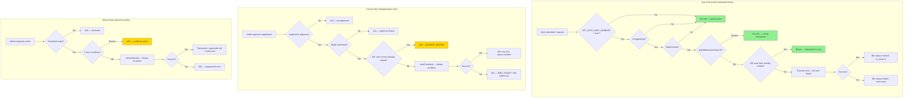

# Idempotency Guard Flow

**Date:** 2026-08-19

```mermaid
graph TD
    subgraph "Quiz Path (mintCredentialForQuiz)"
        Q_START[Quiz submitted + passed] --> Q_GATE1{NFT_AUTO_MINT_ENABLED = 'true'?}
        Q_GATE1 -->|No| Q_SKIP[No mint — guard active]
        Q_GATE1 -->|Yes| Q_GATE2{isTriggerQuiz?}
        Q_GATE2 -->|No| Q_SKIP
        Q_GATE2 -->|Yes| Q_GATE3{Wallet linked?}
        Q_GATE3 -->|No| Q_SKIP
        Q_GATE3 -->|Yes| Q_CONFIG{getNftNetworkConfig OK?}
        Q_CONFIG -->|Throws| Q_SKIP2[No mint — config incomplete]
        Q_CONFIG -->|OK| Q_IDEM{DB: user+quiz already minted?}
        Q_IDEM -->|Yes| Q_NOOP[Return — idempotent no-op]
        Q_IDEM -->|No| Q_MINT[Execute mint — fire and forget]
        Q_MINT --> Q_SUCCESS{Success?}
        Q_SUCCESS -->|Yes| Q_UPDATE[DB: status='minted', tx_hash=X]
        Q_SUCCESS -->|No| Q_FAIL[DB: status='failed', error=msg]
    end

    subgraph "Course Path (nftApplications mint)"
        C_START[Admin approves application] --> C_GATE1{Application approved?}
        C_GATE1 -->|No| C_REJECT[422 — not approved]
        C_GATE1 -->|Yes| C_GATE2{Wallet still linked?}
        C_GATE2 -->|No| C_REJECT2[422 — wallet not linked]
        C_GATE2 -->|Yes| C_IDEM{DB: user+course already minted?}
        C_IDEM -->|Yes| C_CONFLICT[409 — ALREADY_MINTED]
        C_IDEM -->|No| C_MINT[mintCredential — throws on failure]
        C_MINT --> C_SUCCESS{Success?}
        C_SUCCESS -->|Yes| C_INSERT[DB: new row, status='minted']
        C_SUCCESS -->|No| C_502[502 — MINT_FAILED + DB 'failed' row]
    end

    subgraph "Remint Path (adminController)"
        R_START[Admin requests remint] --> R_GATE1{Credential exists?}
        R_GATE1 -->|No| R_404[404 — not found]
        R_GATE1 -->|Yes| R_GATE2{1-hour cooldown?}
        R_GATE2 -->|Recent| R_429[429 — cooldown active]
        R_GATE2 -->|OK| R_MINT[mintCredential — throws on failure]
        R_MINT --> R_SUCCESS{Success?}
        R_SUCCESS -->|Yes| R_TXN["Transaction: supersede old + insert new"]
        R_SUCCESS -->|No| R_502[502 — categorized error]
    end

    style Q_SKIP fill:#90EE90
    style Q_SKIP2 fill:#90EE90
    style Q_NOOP fill:#90EE90
    style C_CONFLICT fill:#FFD700
    style R_429 fill:#FFD700
```
