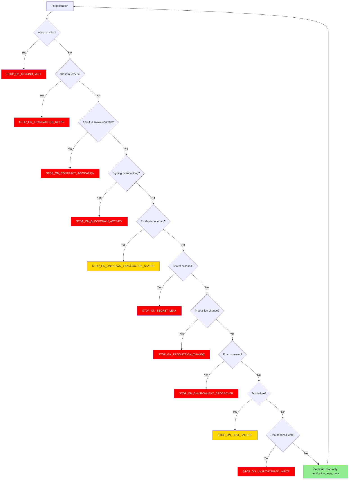

# Loop Stop Conditions

**Date:** 2026-08-19

```mermaid
flowchart TD
    LOOP["/loop iteration"] --> CHECK1{About to mint?}
    CHECK1 -->|Yes| STOP1[STOP_ON_SECOND_MINT]
    CHECK1 -->|No| CHECK2{About to retry tx?}
    CHECK2 -->|Yes| STOP2[STOP_ON_TRANSACTION_RETRY]
    CHECK2 -->|No| CHECK3{About to invoke contract?}
    CHECK3 -->|Yes| STOP3[STOP_ON_CONTRACT_INVOCATION]
    CHECK3 -->|No| CHECK4{Signing or submitting?}
    CHECK4 -->|Yes| STOP4[STOP_ON_BLOCKCHAIN_ACTIVITY]
    CHECK4 -->|No| CHECK5{Tx status uncertain?}
    CHECK5 -->|Yes| STOP5[STOP_ON_UNKNOWN_TRANSACTION_STATUS]
    CHECK5 -->|No| CHECK6{Secret exposed?}
    CHECK6 -->|Yes| STOP6[STOP_ON_SECRET_LEAK]
    CHECK6 -->|No| CHECK7{Production change?}
    CHECK7 -->|Yes| STOP7[STOP_ON_PRODUCTION_CHANGE]
    CHECK7 -->|No| CHECK8{Env crossover?}
    CHECK8 -->|Yes| STOP8[STOP_ON_ENVIRONMENT_CROSSOVER]
    CHECK8 -->|No| CHECK9{Test failure?}
    CHECK9 -->|Yes| STOP9[STOP_ON_TEST_FAILURE]
    CHECK9 -->|No| CHECK10{Unauthorized write?}
    CHECK10 -->|Yes| STOP10[STOP_ON_UNAUTHORIZED_WRITE]
    CHECK10 -->|No| SAFE[Continue: read-only verification, tests, docs]
    SAFE --> LOOP

    style STOP1 fill:#FF0000,color:#FFFFFF
    style STOP2 fill:#FF0000,color:#FFFFFF
    style STOP3 fill:#FF0000,color:#FFFFFF
    style STOP4 fill:#FF0000,color:#FFFFFF
    style STOP5 fill:#FFD700
    style STOP6 fill:#FF0000,color:#FFFFFF
    style STOP7 fill:#FF0000,color:#FFFFFF
    style STOP8 fill:#FF0000,color:#FFFFFF
    style STOP9 fill:#FFD700
    style STOP10 fill:#FF0000,color:#FFFFFF
    style SAFE fill:#90EE90
```
