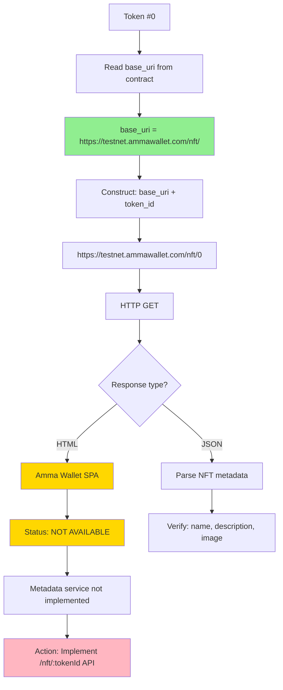

# Metadata Resolution Flow

**Date:** 2026-08-19

```mermaid
flowchart TD
    TOKEN[Token #0] --> URI_READ[Read base_uri from contract]
    URI_READ --> URI_VAL[base_uri = https://testnet.ammawallet.com/nft/]
    URI_VAL --> CONSTRUCT[Construct: base_uri + token_id]
    CONSTRUCT --> URL[https://testnet.ammawallet.com/nft/0]
    URL --> HTTP[HTTP GET]
    HTTP --> RESPONSE{Response type?}
    RESPONSE -->|JSON| JSON_OK[Parse NFT metadata]
    RESPONSE -->|HTML| SPA[Amma Wallet SPA]
    SPA --> STATUS[Status: NOT AVAILABLE]
    STATUS --> REASON[Metadata service not implemented]
    REASON --> ACTION[Action: Implement /nft/:tokenId API]
    JSON_OK --> FIELDS[Verify: name, description, image]

    style URI_VAL fill:#90EE90
    style SPA fill:#FFD700
    style STATUS fill:#FFD700
    style ACTION fill:#FFB6C1
```
