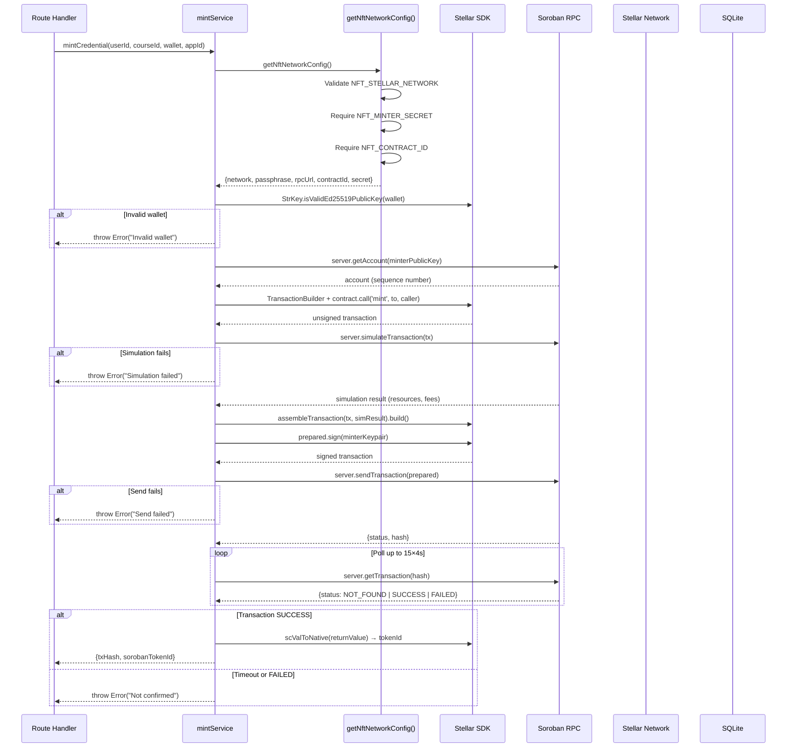

# Mint Lifecycle Flow

**Date:** 2026-08-19

```mermaid
sequenceDiagram
    participant Caller as Route Handler
    participant MS as mintService
    participant Config as getNftNetworkConfig()
    participant SDK as Stellar SDK
    participant RPC as Soroban RPC
    participant Chain as Stellar Network
    participant DB as SQLite

    Caller->>MS: mintCredential(userId, courseId, wallet, appId)
    MS->>Config: getNftNetworkConfig()
    Config->>Config: Validate NFT_STELLAR_NETWORK
    Config->>Config: Require NFT_MINTER_SECRET
    Config->>Config: Require NFT_CONTRACT_ID
    Config-->>MS: {network, passphrase, rpcUrl, contractId, secret}

    MS->>SDK: StrKey.isValidEd25519PublicKey(wallet)
    alt Invalid wallet
        MS-->>Caller: throw Error("Invalid wallet")
    end

    MS->>RPC: server.getAccount(minterPublicKey)
    RPC-->>MS: account (sequence number)

    MS->>SDK: TransactionBuilder + contract.call('mint', to, caller)
    SDK-->>MS: unsigned transaction

    MS->>RPC: server.simulateTransaction(tx)
    alt Simulation fails
        MS-->>Caller: throw Error("Simulation failed")
    end
    RPC-->>MS: simulation result (resources, fees)

    MS->>SDK: assembleTransaction(tx, simResult).build()
    MS->>SDK: prepared.sign(minterKeypair)
    SDK-->>MS: signed transaction

    MS->>RPC: server.sendTransaction(prepared)
    alt Send fails
        MS-->>Caller: throw Error("Send failed")
    end
    RPC-->>MS: {status, hash}

    loop Poll up to 15×4s
        MS->>RPC: server.getTransaction(hash)
        RPC-->>MS: {status: NOT_FOUND | SUCCESS | FAILED}
    end

    alt Transaction SUCCESS
        MS->>SDK: scValToNative(returnValue) → tokenId
        MS-->>Caller: {txHash, sorobanTokenId}
    else Timeout or FAILED
        MS-->>Caller: throw Error("Not confirmed")
    end
```
