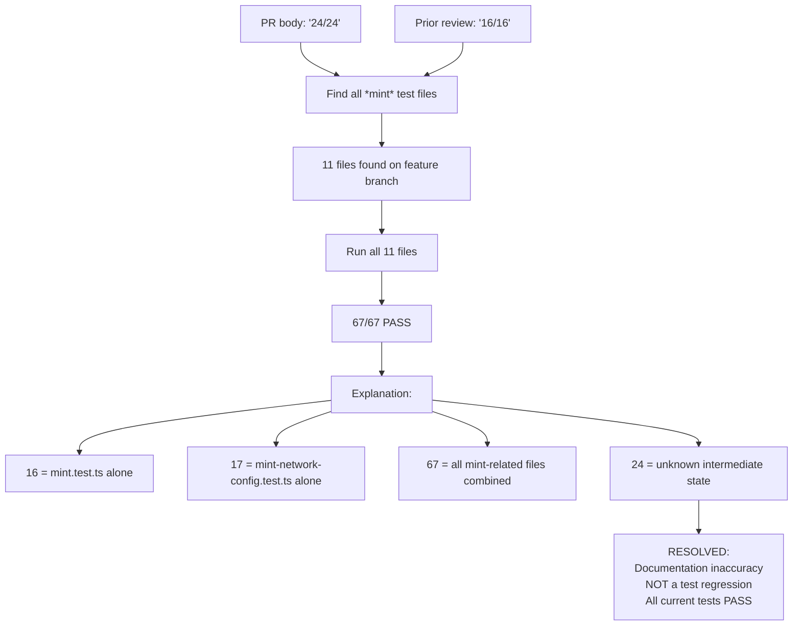

# Mint Test Discrepancy Resolution

```mermaid
flowchart TD
    Claim1["PR body: '24/24'"] --> Investigate
    Claim2["Prior review: '16/16'"] --> Investigate

    Investigate["Find all *mint* test files"] --> Found["11 files found on feature branch"]

    Found --> Run["Run all 11 files"]
    Run --> Result["67/67 PASS"]

    Result --> Explain["Explanation:"]
    Explain --> E1["16 = mint.test.ts alone"]
    Explain --> E2["17 = mint-network-config.test.ts alone"]
    Explain --> E3["67 = all mint-related files combined"]
    Explain --> E4["24 = unknown intermediate state"]

    E4 --> Conclusion["RESOLVED:<br/>Documentation inaccuracy<br/>NOT a test regression<br/>All current tests PASS"]
```
