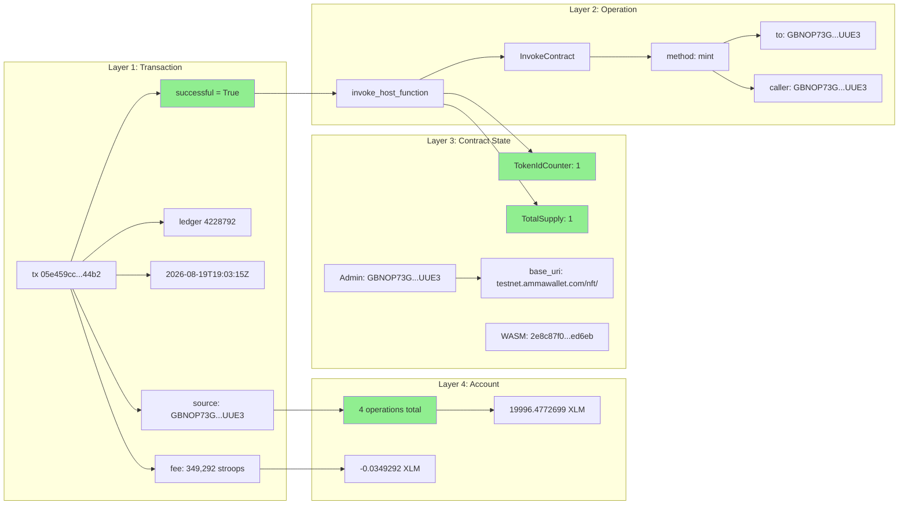

# Mint Transaction Evidence Chain

**Date:** 2026-08-19

```mermaid
graph LR
    subgraph "Layer 1: Transaction"
        TX[tx 05e459cc...44b2]
        TX_OK[successful = True]
        TX_LEDGER[ledger 4228792]
        TX_TIME[2026-08-19T19:03:15Z]
        TX_SRC[source: GBNOP73G...UUE3]
        TX_FEE[fee: 349,292 stroops]
    end

    subgraph "Layer 2: Operation"
        OP[invoke_host_function]
        OP_FN[InvokeContract]
        OP_METHOD[method: mint]
        OP_TO[to: GBNOP73G...UUE3]
        OP_CALLER[caller: GBNOP73G...UUE3]
    end

    subgraph "Layer 3: Contract State"
        CS_COUNTER[TokenIdCounter: 1]
        CS_SUPPLY[TotalSupply: 1]
        CS_ADMIN[Admin: GBNOP73G...UUE3]
        CS_URI[base_uri: testnet.ammawallet.com/nft/]
        CS_WASM[WASM: 2e8c87f0...ed6eb]
    end

    subgraph "Layer 4: Account"
        ACC_OPS[4 operations total]
        ACC_BAL[19996.4772699 XLM]
        ACC_DELTA[-0.0349292 XLM]
    end

    TX --> TX_OK --> OP
    TX --> TX_LEDGER
    TX --> TX_TIME
    TX --> TX_SRC
    TX --> TX_FEE --> ACC_DELTA
    OP --> OP_FN --> OP_METHOD
    OP_METHOD --> OP_TO
    OP_METHOD --> OP_CALLER
    OP --> CS_COUNTER
    OP --> CS_SUPPLY
    CS_ADMIN --> CS_URI
    TX_SRC --> ACC_OPS
    ACC_OPS --> ACC_BAL

    style TX_OK fill:#90EE90
    style CS_COUNTER fill:#90EE90
    style CS_SUPPLY fill:#90EE90
    style ACC_OPS fill:#90EE90
```
