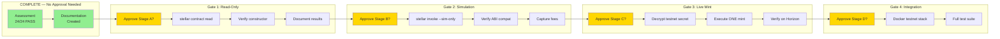

# Next Stage Approval Gates

**Date:** 2026-08-19

```mermaid
graph LR
    subgraph "COMPLETE — No Approval Needed"
        ASSESS[Assessment<br/>24/24 PASS]
        DOCS[Documentation<br/>Created]
    end

    subgraph "Gate 1: Read-Only"
        G1[Approve Stage A?]
        A1[stellar contract read]
        A2[Verify constructor]
        A3[Document results]
    end

    subgraph "Gate 2: Simulation"
        G2[Approve Stage B?]
        B1[stellar invoke --sim-only]
        B2[Verify ABI compat]
        B3[Capture fees]
    end

    subgraph "Gate 3: Live Mint"
        G3[Approve Stage C?]
        C1[Decrypt testnet secret]
        C2[Execute ONE mint]
        C3[Verify on Horizon]
    end

    subgraph "Gate 4: Integration"
        G4[Approve Stage D?]
        D1[Docker testnet stack]
        D2[Full test suite]
    end

    ASSESS --> DOCS
    DOCS --> G1
    G1 --> A1 --> A2 --> A3
    A3 --> G2
    G2 --> B1 --> B2 --> B3
    B3 --> G3
    G3 --> C1 --> C2 --> C3
    C3 --> G4
    G4 --> D1 --> D2

    style ASSESS fill:#90EE90
    style DOCS fill:#90EE90
    style G1 fill:#FFD700
    style G2 fill:#FFD700
    style G3 fill:#FFD700
    style G4 fill:#FFD700
```
