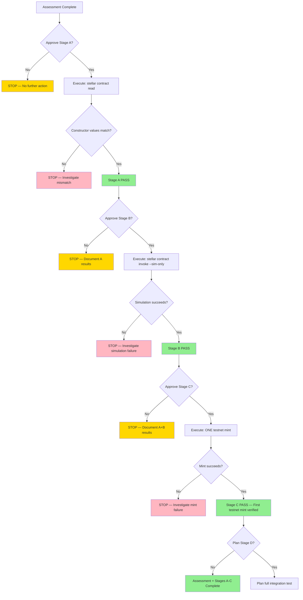

# Next Stage Decision Flow

**Date:** 2026-08-19

```mermaid
graph TD
    START[Assessment Complete] --> A_APPROVE{Approve Stage A?}
    A_APPROVE -->|No| STOP_A[STOP — No further action]
    A_APPROVE -->|Yes| A_EXEC[Execute: stellar contract read]
    A_EXEC --> A_CHECK{Constructor values match?}
    A_CHECK -->|No| A_FAIL[STOP — Investigate mismatch]
    A_CHECK -->|Yes| A_PASS[Stage A PASS]
    A_PASS --> B_APPROVE{Approve Stage B?}
    B_APPROVE -->|No| STOP_B[STOP — Document A results]
    B_APPROVE -->|Yes| B_EXEC[Execute: stellar contract invoke --sim-only]
    B_EXEC --> B_CHECK{Simulation succeeds?}
    B_CHECK -->|No| B_FAIL[STOP — Investigate simulation failure]
    B_CHECK -->|Yes| B_PASS[Stage B PASS]
    B_PASS --> C_APPROVE{Approve Stage C?}
    C_APPROVE -->|No| STOP_C[STOP — Document A+B results]
    C_APPROVE -->|Yes| C_EXEC[Execute: ONE testnet mint]
    C_EXEC --> C_CHECK{Mint succeeds?}
    C_CHECK -->|No| C_FAIL[STOP — Investigate mint failure]
    C_CHECK -->|Yes| C_PASS[Stage C PASS — First testnet mint verified]
    C_PASS --> D_DECIDE{Plan Stage D?}
    D_DECIDE -->|No| DONE[Assessment + Stages A-C Complete]
    D_DECIDE -->|Yes| D_PLAN[Plan full integration test]

    style A_PASS fill:#90EE90
    style B_PASS fill:#90EE90
    style C_PASS fill:#90EE90
    style DONE fill:#90EE90
    style A_FAIL fill:#FFB6C1
    style B_FAIL fill:#FFB6C1
    style C_FAIL fill:#FFB6C1
    style STOP_A fill:#FFD700
    style STOP_B fill:#FFD700
    style STOP_C fill:#FFD700
```
