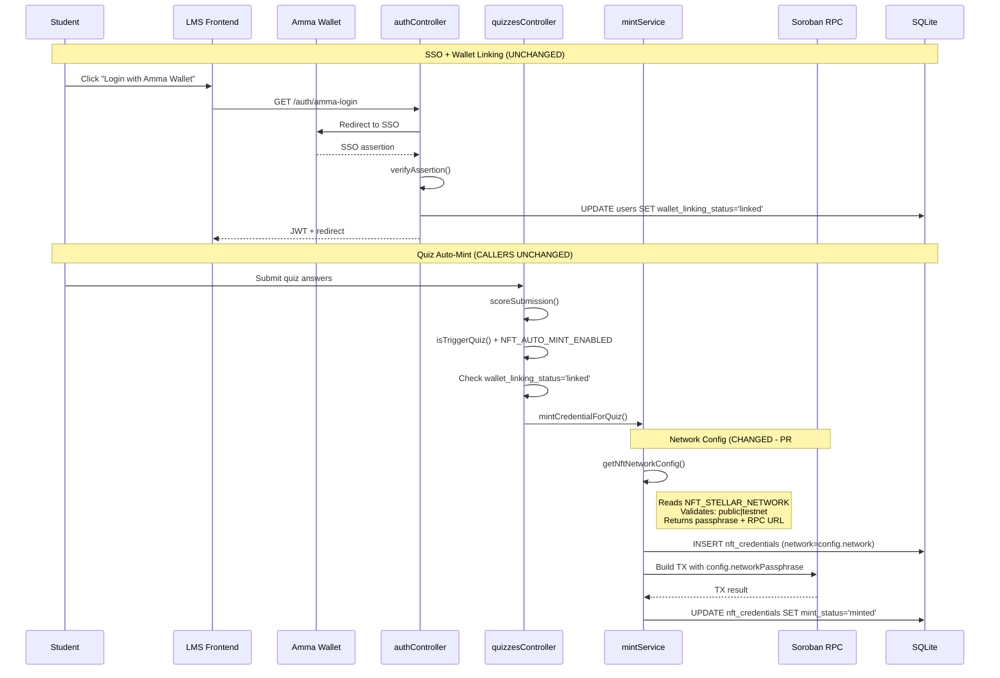

# NFT Amma Wallet Integration Flow

```mermaid
sequenceDiagram
    participant Student
    participant LMS as LMS Frontend
    participant AW as Amma Wallet
    participant Auth as authController
    participant Quiz as quizzesController
    participant Mint as mintService
    participant RPC as Soroban RPC
    participant DB as SQLite

    Note over Student,DB: SSO + Wallet Linking (UNCHANGED)
    Student->>LMS: Click "Login with Amma Wallet"
    LMS->>Auth: GET /auth/amma-login
    Auth->>AW: Redirect to SSO
    AW-->>Auth: SSO assertion
    Auth->>Auth: verifyAssertion()
    Auth->>DB: UPDATE users SET wallet_linking_status='linked'
    Auth-->>LMS: JWT + redirect

    Note over Student,DB: Quiz Auto-Mint (CALLERS UNCHANGED)
    Student->>Quiz: Submit quiz answers
    Quiz->>Quiz: scoreSubmission()
    Quiz->>Quiz: isTriggerQuiz() + NFT_AUTO_MINT_ENABLED
    Quiz->>Quiz: Check wallet_linking_status='linked'
    Quiz->>Mint: mintCredentialForQuiz()

    Note over Mint,RPC: Network Config (CHANGED - PR #1)
    Mint->>Mint: getNftNetworkConfig()
    Note right of Mint: Reads NFT_STELLAR_NETWORK<br/>Validates: public|testnet<br/>Returns passphrase + RPC URL
    Mint->>DB: INSERT nft_credentials (network=config.network)
    Mint->>RPC: Build TX with config.networkPassphrase
    RPC-->>Mint: TX result
    Mint->>DB: UPDATE nft_credentials SET mint_status='minted'
```
