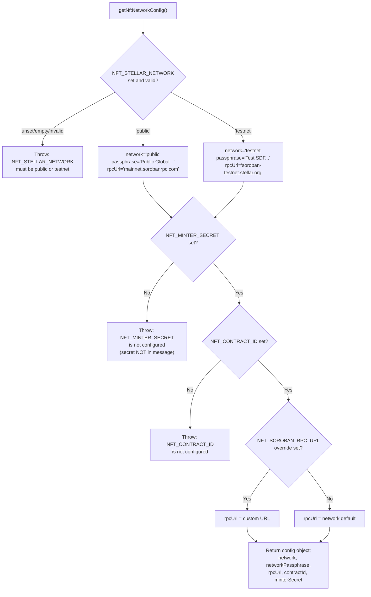

# NFT Network Validation Flow

```mermaid
flowchart TD
    Start["getNftNetworkConfig()"] --> CheckNetwork{"NFT_STELLAR_NETWORK<br/>set and valid?"}
    CheckNetwork -->|"unset/empty/invalid"| ThrowNet["Throw: NFT_STELLAR_NETWORK<br/>must be public or testnet"]
    CheckNetwork -->|"'public'"| Public["network='public'<br/>passphrase='Public Global...'<br/>rpcUrl='mainnet.sorobanrpc.com'"]
    CheckNetwork -->|"'testnet'"| Testnet["network='testnet'<br/>passphrase='Test SDF...'<br/>rpcUrl='soroban-testnet.stellar.org'"]

    Public --> CheckSecret{"NFT_MINTER_SECRET set?"}
    Testnet --> CheckSecret

    CheckSecret -->|No| ThrowSecret["Throw: NFT_MINTER_SECRET<br/>is not configured<br/>(secret NOT in message)"]
    CheckSecret -->|Yes| CheckContract{"NFT_CONTRACT_ID set?"}

    CheckContract -->|No| ThrowContract["Throw: NFT_CONTRACT_ID<br/>is not configured"]
    CheckContract -->|Yes| CheckRPC{"NFT_SOROBAN_RPC_URL<br/>override set?"}

    CheckRPC -->|Yes| UseCustomRPC["rpcUrl = custom URL"]
    CheckRPC -->|No| UseDefaultRPC["rpcUrl = network default"]

    UseCustomRPC --> Return["Return config object:<br/>network, networkPassphrase,<br/>rpcUrl, contractId, minterSecret"]
    UseDefaultRPC --> Return
```
