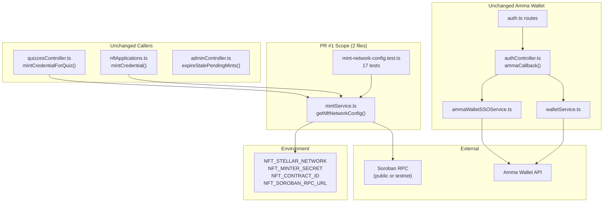

# NFT PR Review Context Diagram

```mermaid
graph TB
    subgraph "PR #1 Scope (2 files)"
        MintService["mintService.ts<br/>getNftNetworkConfig()"]
        NetTests["mint-network-config.test.ts<br/>17 tests"]
    end

    subgraph "Unchanged Callers"
        QuizCtrl["quizzesController.ts<br/>mintCredentialForQuiz()"]
        NFTApps["nftApplications.ts<br/>mintCredential()"]
        AdminCtrl["adminController.ts<br/>expireStalePendingMints()"]
    end

    subgraph "Unchanged Amma Wallet"
        SSO["ammaWalletSSOService.ts"]
        AuthCtrl["authController.ts<br/>ammaCallback()"]
        WalletSvc["walletService.ts"]
        AuthRoutes["auth.ts routes"]
    end

    subgraph "External"
        SorobanRPC["Soroban RPC<br/>(public or testnet)"]
        AmmaWallet["Amma Wallet API"]
    end

    subgraph "Environment"
        ENV["NFT_STELLAR_NETWORK<br/>NFT_MINTER_SECRET<br/>NFT_CONTRACT_ID<br/>NFT_SOROBAN_RPC_URL"]
    end

    QuizCtrl --> MintService
    NFTApps --> MintService
    MintService --> SorobanRPC
    MintService --> ENV
    NetTests --> MintService
    AuthRoutes --> AuthCtrl
    AuthCtrl --> SSO
    SSO --> AmmaWallet
    AuthCtrl --> WalletSvc
    WalletSvc --> AmmaWallet
```
